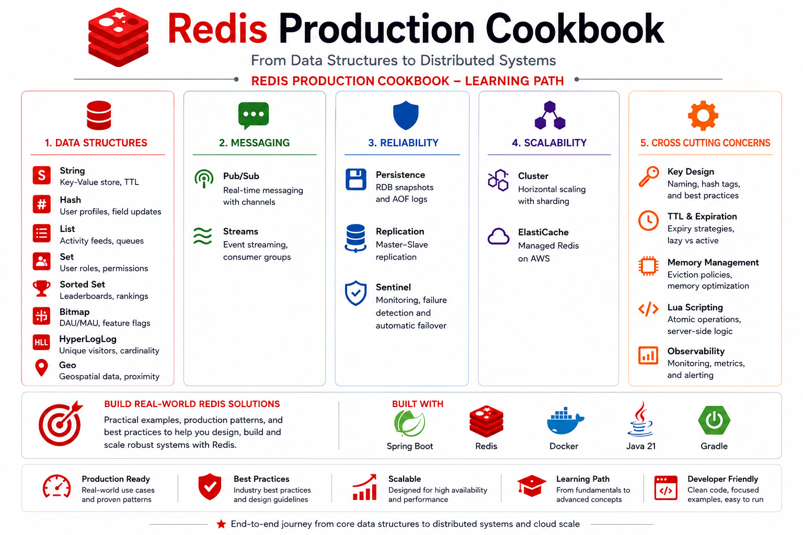

# Redis Production Cookbook



Production-focused Redis examples with Spring Boot, Java 21, and Docker — built so you can **jump
straight to the topic you need** and find a complete, self-contained guide waiting there.

## What This Is

Redis is far more than a cache. This cookbook covers how its features work **and** how to run them
in production: data structures, caching, messaging, search, geospatial, coordination patterns, and
the high-availability/scaling stack (persistence, replication, Sentinel, Cluster, AWS ElastiCache).

It's organized as **one module per topic**. There is no "read it in order" requirement — open the
module you care about and everything you need is in its README.

## Every Module Is Self-Contained

Pick any module below and its `README.md` gives you the whole picture, in the same predictable
shape every time:

- **Plain-English explanation** — the concept from first principles, no prior chapter required.
- **Diagrams** — a visual cheat-sheet for the topic.
- **Hands-on exercise** — something you actually run: a Docker Compose setup, `redis-cli`
  walkthrough, `curl` calls against the Spring Boot app, or an integration test — with the exact
  commands and expected output.
- **Production notes** — trade-offs, gotchas, and best practices.
- **Interview notes** — the questions people get asked, answered.

So you never have to wonder *"where do I find this?"* — it's in the module's README — or
*"where do I go next?"* — the [Suggested Path](#suggested-path) and cross-links tell you.

## Module Index

Every name links to that module's self-contained README. `📦` = runnable Docker/IaC setup ·
`🌐` = REST endpoints + `curl` · `🧪` = integration tests.

### Foundations — Data Structures
[Overview](src/main/java/io/github/divakar/redisproductioncookbook/features/datastructures/README.md)

| Module | What you'll learn | Hands-on |
|--------|-------------------|----------|
| [String](src/main/java/io/github/divakar/redisproductioncookbook/features/datastructures/string/README.md) | Production-style session store | 🌐 🧪 |
| [Hash](src/main/java/io/github/divakar/redisproductioncookbook/features/datastructures/hash/README.md) | User profile repository | 🌐 🧪 |
| [List](src/main/java/io/github/divakar/redisproductioncookbook/features/datastructures/list/README.md) | Recent activity feed | 🌐 🧪 |
| [Set](src/main/java/io/github/divakar/redisproductioncookbook/features/datastructures/set/README.md) | User roles and permissions | 🌐 🧪 |
| [Sorted Set](src/main/java/io/github/divakar/redisproductioncookbook/features/datastructures/sortedset/README.md) | Global leaderboard | 🌐 🧪 |
| [Bitmap](src/main/java/io/github/divakar/redisproductioncookbook/features/datastructures/bitmap/README.md) | Daily active users | 🌐 🧪 |
| [HyperLogLog](src/main/java/io/github/divakar/redisproductioncookbook/features/datastructures/hyperlog/README.md) | Unique visitor counting | 🌐 🧪 |

### Patterns
| Module | What you'll learn | Hands-on |
|--------|-------------------|----------|
| [Caching](src/main/java/io/github/divakar/redisproductioncookbook/features/patterns/caching/README.md) | Cache-aside, write-through/behind, refresh-ahead, stampede protection, invalidation | 🌐 🧪 |
| [Rate Limiting](src/main/java/io/github/divakar/redisproductioncookbook/features/patterns/ratelimiter/README.md) | Fixed/sliding window, token bucket — one atomic Lua script each | 🌐 🧪 |
| [Distributed Locks](src/main/java/io/github/divakar/redisproductioncookbook/features/patterns/locks/README.md) | Mutual exclusion across instances, safe release/renew, watchdog | 🌐 🧪 |
| [Transactions](src/main/java/io/github/divakar/redisproductioncookbook/features/patterns/transactions/README.md) | `MULTI`/`EXEC` and optimistic locking with `WATCH` | 🌐 🧪 |

### Messaging
| Module | What you'll learn | Hands-on |
|--------|-------------------|----------|
| [Pub/Sub](src/main/java/io/github/divakar/redisproductioncookbook/features/messaging/pubsub/README.md) | Real-time fan-out broadcast (at-most-once), Pub/Sub vs Kafka | 🌐 🧪 |
| [Streams](src/main/java/io/github/divakar/redisproductioncookbook/features/messaging/streams/README.md) | Durable event log, consumer groups, recovery (at-least-once) | 🌐 🧪 |

### Querying
| Module | What you'll learn | Hands-on |
|--------|-------------------|----------|
| [Geo](src/main/java/io/github/divakar/redisproductioncookbook/features/querying/geo/README.md) | Geospatial indexing and nearby search (restaurant discovery) | 🌐 🧪 |
| [Search](src/main/java/io/github/divakar/redisproductioncookbook/features/querying/search/README.md) | Full-text search, indexing, filters, BM25 ranking | 🌐 🧪 |

### Infrastructure — High Availability, Scaling & Ops
| Module | What you'll learn | Hands-on |
|--------|-------------------|----------|
| [Persistence](src/main/java/io/github/divakar/redisproductioncookbook/features/infrastructure/persistence/README.md) | RDB, AOF, hybrid, and surviving restarts | 📦 |
| [Replication](src/main/java/io/github/divakar/redisproductioncookbook/features/infrastructure/replication/README.md) | Read scaling, HA, consistency trade-offs | 📦 |
| [Sentinel](src/main/java/io/github/divakar/redisproductioncookbook/features/infrastructure/sentinel/README.md) | Automatic failover and high availability | 📦 |
| [Cluster](src/main/java/io/github/divakar/redisproductioncookbook/features/infrastructure/cluster/README.md) | Sharding, hash slots, rebalancing, per-shard failover | 📦 |
| [AWS ElastiCache](src/main/java/io/github/divakar/redisproductioncookbook/features/infrastructure/elasticache/README.md) | Production Redis on AWS (Terraform + CLI), Multi-AZ, Global Datastore | 📦 |

## Suggested Path

No order is required, but if you want a progression from fundamentals to production:

1. **Foundations** → the [Data Structures](src/main/java/io/github/divakar/redisproductioncookbook/features/datastructures/README.md) modules.
2. **Patterns** → [Caching](src/main/java/io/github/divakar/redisproductioncookbook/features/patterns/caching/README.md) → [Rate Limiting](src/main/java/io/github/divakar/redisproductioncookbook/features/patterns/ratelimiter/README.md) → [Locks](src/main/java/io/github/divakar/redisproductioncookbook/features/patterns/locks/README.md) → [Transactions](src/main/java/io/github/divakar/redisproductioncookbook/features/patterns/transactions/README.md).
3. **Messaging** → [Pub/Sub](src/main/java/io/github/divakar/redisproductioncookbook/features/messaging/pubsub/README.md) → [Streams](src/main/java/io/github/divakar/redisproductioncookbook/features/messaging/streams/README.md).
4. **Querying** → [Geo](src/main/java/io/github/divakar/redisproductioncookbook/features/querying/geo/README.md) → [Search](src/main/java/io/github/divakar/redisproductioncookbook/features/querying/search/README.md).
5. **Infrastructure** → [Persistence](src/main/java/io/github/divakar/redisproductioncookbook/features/infrastructure/persistence/README.md) → [Replication](src/main/java/io/github/divakar/redisproductioncookbook/features/infrastructure/replication/README.md) → [Sentinel](src/main/java/io/github/divakar/redisproductioncookbook/features/infrastructure/sentinel/README.md) → [Cluster](src/main/java/io/github/divakar/redisproductioncookbook/features/infrastructure/cluster/README.md) → [ElastiCache](src/main/java/io/github/divakar/redisproductioncookbook/features/infrastructure/elasticache/README.md).

## Getting Started

### Prerequisites

- Java 21
- Docker (Docker Desktop or Rancher Desktop)
- Gradle (the wrapper `./gradlew` is included)

### Clone

```bash
git clone https://github.com/DivakarUngatla/redis-production-cookbook.git
cd redis-production-cookbook
```

### Start Redis (Redis 8 — includes the query/search engine)

```bash
docker compose up -d
docker exec -it redis-local redis-cli ping   # -> PONG
```

### Run the application

```bash
./gradlew bootRun
```

The 🌐 modules expose REST endpoints; each module README lists the exact `curl` commands.

### Run the tests

The 🧪 integration tests run against the local Redis above, so start it first:

```bash
docker compose up -d
./gradlew test
```

> The 📦 infrastructure modules (Persistence, Replication, Sentinel, Cluster, ElastiCache) ship
> their own runnable setups (Docker Compose / Terraform) inside the module folder — see each
> module's README for its self-contained hands-on.

## Source Layout

```text
src/main/java/.../features/
├── datastructures/   string, hash, list, set, sortedset, bitmap, hyperlog
├── patterns/         caching, ratelimiter, locks, transactions
├── messaging/        pubsub, streams
├── querying/         geo, search
└── infrastructure/   persistence, replication, sentinel, cluster, elasticache
```

Every leaf folder is a module with its own `README.md` (and code/config/tests where applicable).
