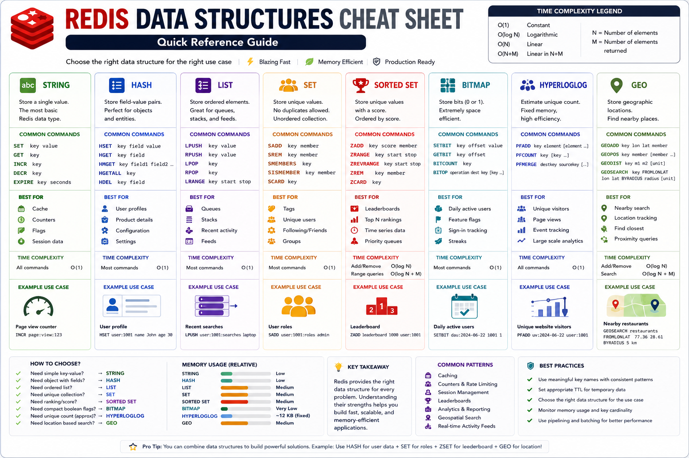

# Redis Data Structures

This module and the submodules demonstrates the most commonly used Redis data structures through real-world use cases. Each module focuses on a specific Redis data structure, explains when to use it, and provides a complete implementation including:

- Domain Model
- Repository Layer
- REST APIs
- Redis Commands
- Production Considerations
- Interview Notes

The goal is to learn Redis by building practical applications rather than memorizing commands.



## Introduction

Redis is much more than a cache.

Modern applications use Redis for:

- User Profiles
- Recent Activity Feeds
- Shopping Carts
- Leaderboards
- Feature Flags
- Analytics
- Rate Limiting
- Session Management
- Location-Based Search
- Real-Time Messaging

Choosing the correct data structure is one of the most important Redis design decisions.

This repository provides practical examples showing how each Redis data structure maps to a real-world problem.

---

## Learning Path

We recommend learning the modules in the following order:

```text
String
  ↓
Hash
  ↓
List
  ↓
Set
  ↓
Sorted Set
  ↓
Bitmap
  ↓
HyperLogLog
  ↓
Geo
```

Each module builds on concepts introduced in previous modules.

---

## Choosing the Right Data Structure

| Requirement | Recommended Structure |
|------------|----------------------|
| Store a single value | String |
| Store an object | Hash |
| Ordered collection | List |
| Unique values | Set |
| Ranking / Score-based ordering | Sorted Set |
| Compact boolean flags | Bitmap |
| Approximate unique count | HyperLogLog |
| Geographic search | Geo |

---

## Modules Covered

| Data Structure | Real-World Use Case | Redis Commands | Status |
|---------------|--------------------|----------------|---------|
| Hash | User Profile | HSET, HGET, HMGET, HGETALL | ✅ |
| List | Recent Searches | LPUSH, RPUSH, LPOP, LRANGE | ✅ |
| Set | User Roles | SADD, SREM, SMEMBERS, SISMEMBER | ✅ |
| Sorted Set | Leaderboard | ZADD, ZRANGE, ZREVRANGE, ZRANK | ✅ |
| Bitmap | Daily / Monthly Active Users | SETBIT, GETBIT, BITCOUNT, BITOP | ✅ |
| HyperLogLog | Unique Website Visitors | PFADD, PFCOUNT, PFMERGE | ✅ |
| Geo | Nearby Search | GEOADD, GEOPOS, GEODIST, GEOSEARCH | 🚧 |

---

## Comparison Matrix

| Structure | Lookup | Ordering | Unique Values | Memory Efficiency | Typical Use Case |
|------------|---------|----------|---------------|------------------|------------------|
| String | O(1) | No | No | High | Cache, Counters |
| Hash | O(1) | No | Field Names | High | User Profiles |
| List | O(N) | Yes | No | Medium | Activity Feeds |
| Set | O(1) | No | Yes | Medium | Tags, Roles |
| Sorted Set | O(log N) | Score Based | Yes | Medium | Leaderboards |
| Bitmap | O(1) | No | N/A | Very High | DAU / MAU |
| HyperLogLog | Approximate | No | N/A | Extremely High | Unique Visitors |
| Geo | O(log N) | Distance Based | Yes | Medium | Nearby Search |

---

## Real-World Use Cases

### Hash

```text
User Profile
Product Details
Configuration Data
```

### List

```text
Recent Searches
Activity Feed
Task Queue
```

### Set

```text
User Roles
Tags
Followers
```

### Sorted Set

```text
Leaderboards
Top N Rankings
Priority Queues
```

### Bitmap

```text
Daily Active Users
Feature Flags
Sign-in Tracking
```

### HyperLogLog

```text
Unique Visitors
Analytics
Event Tracking
```

### Geo

```text
Nearby Restaurants
Ride Sharing
Store Locator
Location Tracking
```

---

## Repository Structure

```text
src
└── main
    └── java
        └── io.github.divakar.redisproductioncookbook
            └── features
                └── datastructures
                    ├── hash
                    ├── list
                    ├── set
                    ├── sortedset
                    ├── bitmap
                    ├── hyperlog
                    └── geo
```

Each module contains:

```text
README
Entity / Domain Model
Repository Layer
Controller Layer
Redis Commands
Real-World Examples
```

---

## Technology Stack

- Java 21
- Spring Boot
- Spring Data Redis
- Redis 7+
- Docker Compose
- Gradle

---

## Running the Examples

Start Redis:

```bash
docker compose up -d
```

Start the application:

```bash
./gradlew bootRun
```

Application:

```text
http://localhost:8080
```

---

## Redis Commands Covered

### Hash

```redis
HSET
HGET
HMGET
HGETALL
HDEL
```

### List

```redis
LPUSH
RPUSH
LPOP
RPOP
LRANGE
LLEN
```

### Set

```redis
SADD
SREM
SMEMBERS
SISMEMBER
SCARD
SUNION
SINTER
SDIFF
```

### Sorted Set

```redis
ZADD
ZRANGE
ZREVRANGE
ZRANK
ZSCORE
ZREM
```

### Bitmap

```redis
SETBIT
GETBIT
BITCOUNT
BITOP
```

### HyperLogLog

```redis
PFADD
PFCOUNT
PFMERGE
```

### Geo

```redis
GEOADD
GEOPOS
GEODIST
GEOSEARCH
```

---

## Time Complexity Quick Reference

| Operation | Complexity |
|------------|------------|
| GET / SET | O(1) |
| HGET / HSET | O(1) |
| LPUSH / RPUSH | O(1) |
| SADD / SISMEMBER | O(1) |
| ZADD | O(log N) |
| ZRANGE | O(log N + M) |
| BITCOUNT | O(N) |
| PFCOUNT | O(1) |
| GEOSEARCH | O(log N) |

---

## Design Principles

The repository intentionally hides Redis implementation details behind business-oriented APIs.

For example:

| Redis Structure | Business Use Case |
|----------------|-------------------|
| Hash | User Profile |
| List | Recent Searches |
| Set | User Roles |
| Sorted Set | Leaderboard |
| Bitmap | User Activity |
| HyperLogLog | Visitor Analytics |
| Geo | Nearby Search |

Clients interact with business concepts rather than Redis commands.

---

## Best Practices Demonstrated

- Consistent key naming conventions
- TTL management
- Domain-driven repository APIs
- Separation of concerns
- Production-oriented examples
- Redis command explanations
- Performance considerations
- Scalable key design

---

## Next Steps

Upcoming Redis capabilities:

```text
Streams
Pub/Sub
Distributed Locks
Transactions
Caching Patterns
Redis Cluster
Redis Sentinel
```

---

## Key Takeaways

- Redis offers specialized data structures for different workloads.
- Choosing the correct structure is critical for performance and scalability.
- Every module in this repository maps a Redis concept to a real-world problem.
- Understanding trade-offs is more important than memorizing commands.
- Build practical examples to truly learn Redis.

---

⭐ If this repository helps you learn Redis, consider starring the project and following along as additional modules are added.