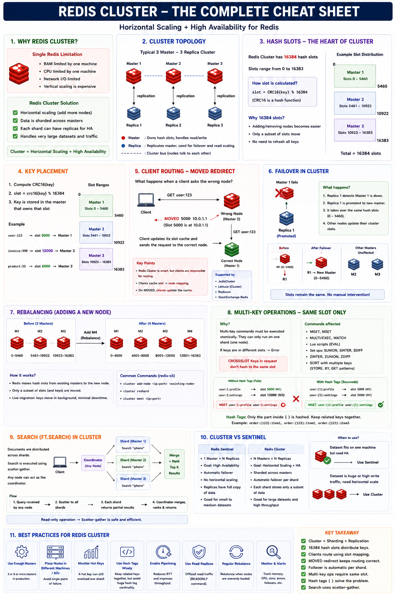
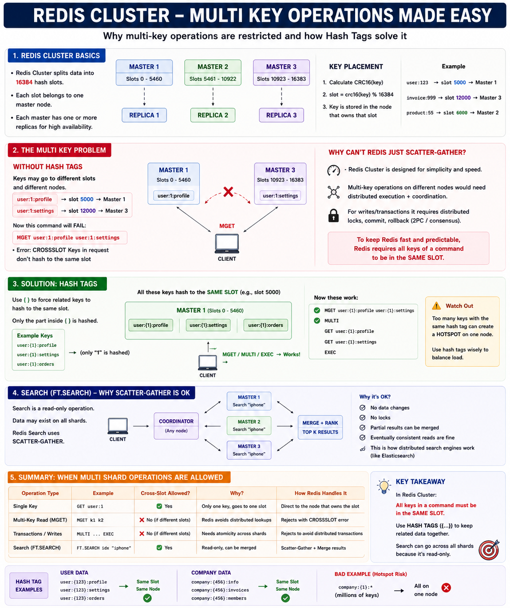
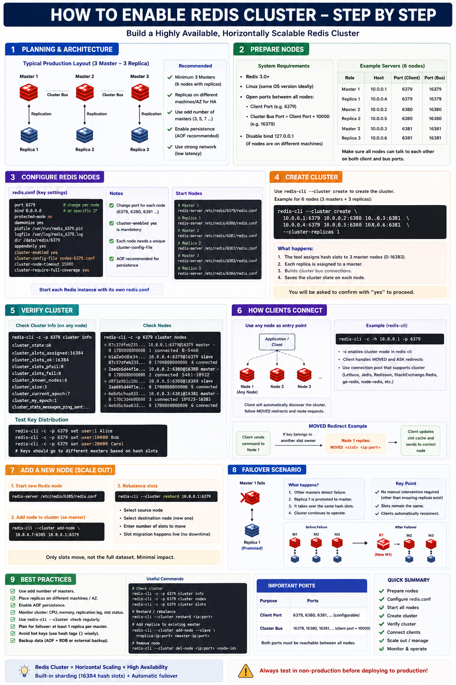

# Redis Cluster: Horizontal Scaling + High Availability

## Introduction

[Replication](../replication/README.md) and [Sentinel](../sentinel/README.md) give you **high
availability** for a *single* dataset — every node still holds the **whole** dataset, so one
machine's RAM, CPU, and network cap your ceiling. **Cluster** removes that ceiling: it **shards**
the keyspace across many primaries so the data and the traffic are split across machines, while
still keeping per-shard replicas for failover.

Two ideas do all the work:

- **Sharding** — the keyspace is divided into **16384 hash slots**; each primary owns a range of
  slots. `slot = CRC16(key) % 16384`.
- **Per-shard HA** — each primary has one or more replicas; if a primary dies, its replica is
  promoted automatically — **for that shard only**, the rest keep serving.

> **Cluster = sharding (scale) + replication (HA).** Sentinel = HA only, no sharding.

This is a **configuration and operations** topic, so this module is a guide plus a runnable
**6-node (3 primaries + 3 replicas)** example you can form and fail over yourself.



> **Hands-on:** there's a runnable example below — see
> [Hands-On: A 6-Node Cluster](#hands-on-a-6-node-cluster) to create a 3-primary / 3-replica
> cluster and watch a shard fail over.

> **Don't skip:** [Hash slots](#hash-slots-the-heart-of-cluster),
> [Client routing & MOVED](#client-routing-and-moved-redirect), and
> [Multi-key operations & hash tags](#multi-key-operations-and-hash-tags) — the parts that
> behave differently from single-node Redis.

## Why Cluster

A single Redis instance is limited by one machine:

- **RAM** — the dataset must fit in one box's memory.
- **CPU / network I/O** — one event loop, one NIC.
- **Vertical scaling is expensive** and eventually hits a wall.

Cluster solves this by **adding nodes** (scale out): data is sharded across primaries, each shard
can have replicas for HA, and it handles very large datasets and high traffic. Failover is
automatic **per shard** — no manual intervention.

## Hash Slots: The Heart of Cluster

Redis Cluster has **16384 hash slots** (numbered 0–16383). Every key maps to exactly one slot:

```text
slot = CRC16(key) % 16384
```

Each primary **owns a contiguous range of slots**. With 3 primaries the default split is:

```text
Primary 1   slots 0      – 5460
Primary 2   slots 5461   – 10922
Primary 3   slots 10923  – 16383
                                  total = 16384 slots
```

**Why 16384 (not, say, per-key hashing)?** Slots are a fixed, coarse unit:

- Adding/removing a node = moving **slots** (and the keys in them), not rehashing every key.
- A key always belongs to one slot, and a slot always belongs to one primary — routing is simple.
- The cluster bus gossips a compact 16384-bit slot map between nodes cheaply.

**Key placement example** (verified with `CLUSTER KEYSLOT`):

```text
user:123     -> slot 12893  -> Primary 3
user:1       -> slot ...    -> some primary
product:55   -> slot ...    -> some primary
```

## Client Routing and MOVED Redirect

Any node can receive a request, but only the node that **owns the key's slot** can serve it. If a
client asks the wrong node:

```text
Client --- GET user:123 ---> Wrong node (doesn't own the slot)
Client <-- MOVED 12893 10.0.0.3:6379 --- (here's who owns it)
Client --- GET user:123 ---> Correct node (owns slot 12893)
```

- The node replies **`MOVED <slot> <host:port>`** instead of the value.
- A **cluster-aware client caches the slot→node map** and sends future requests straight to the
  right node, so MOVED is rare after warm-up. (In `redis-cli`, the `-c` flag enables this.)
- Smart clients that support this: **Lettuce, Jedis, redisson, StackExchange.Redis,
  go-redis, node-redis**, etc.

This is why **the client is responsible for routing** in Cluster — the cluster tells it where
keys live, and the client follows.

## Multi-Key Operations and Hash Tags



A command that touches **multiple keys** can only run if **all those keys live in the same slot**
(same node). Otherwise Redis refuses it:

```text
MGET user:1 user:2     -> (error) CROSSSLOT Keys in request don't hash to the same slot
```

**Why not just scatter-gather across nodes?** Because making `MGET`/`MULTI`/Lua/`SUNIONSTORE`
atomic across different nodes would need distributed transactions/locks (2PC, consensus) — slow
and complex. Cluster keeps writes fast and predictable by requiring same-slot keys.

**Hash tags** are the fix. If a key contains `{...}`, **only the part inside the braces is
hashed**, so you can force related keys onto the same slot:

```text
user:1:profile   vs  user:2:settings   -> different slots -> CROSSSLOT on MGET
user:{1}:profile     user:{1}:settings -> SAME slot       -> MGET works
```

Verified: `CLUSTER KEYSLOT user:{123}:profile` and `user:{123}:settings` both return **5970**, so
`MGET`/`MULTI`/`EXEC` over them succeed on one node.

**Commands that need same-slot keys:** `MGET`/`MSET`, `MULTI`/`EXEC`/`WATCH`, multi-key Lua
(`EVAL` with multiple `KEYS`), `SINTERSTORE`/`SUNIONSTORE`/`SDIFF`, `ZADD GT`-style multi-key,
`SORT ... STORE`.

> **Watch out:** too many keys under one hash tag concentrate on a single node (a hotspot). Use
> hash tags deliberately — group what truly belongs together (one user, one tenant), not
> everything.

## Failover in Cluster

Failover is **per shard** and automatic — and crucially, **Cluster does its own failover; it does
NOT use Sentinel** (see [the callout below](#%EF%B8%8F-cluster-does-not-use-sentinel)). The
cluster nodes detect failure (via the gossip bus) and a **majority of masters** vote to promote
the dead master's replica:

```text
Primary 1 fails
  1. Other nodes detect it (no gossip/PONG within cluster-node-timeout) -> mark it failing.
  2. Its replica is promoted to primary and takes over Primary 1's slots.
  3. The other shards (Primary 2, Primary 3) are unaffected the whole time.
  4. When the old primary restarts, it rejoins as a replica of the new primary.
```

Verified in the demo: stopping a primary briefly put the cluster into `fail` for its slots, then
within ~10–15s the replica was promoted, `cluster_state` returned to `ok`, and the key it owned
was served again — no manual intervention. When the old node restarted it came back as a
**replica**.

> A shard with **no surviving replica** loses its slots and the whole cluster reports
> `cluster_state:fail` until those slots are covered again (this is what `cluster-require-full-coverage`
> controls). Always run at least one replica per primary in production.

## Rebalancing (Adding / Removing Nodes)

Scaling out moves **slots**, not the whole dataset:

```text
Before (3 primaries)         After adding a 4th primary (reshard)
M1 0-5460                    M1 0-4095
M2 5461-10922                M2 4096-8191
M3 10923-16383               M3 8192-12287
                             M4 12288-16383
```

- `redis-cli --cluster add-node <new> <existing>` joins the node.
- `redis-cli --cluster reshard <node>` moves a subset of slots (and their keys) to it.
- Migration is **live**: keys move in the background with minimal downtime; only the moving slots
  are briefly affected.

## Search (FT.SEARCH) in a Cluster

Full-text [search](../../querying/search/README.md) is a **read-only scatter-gather** and is the exception to
the same-slot rule: a coordinator node fans the query out to all shards, each returns its local
top results, and the coordinator merges and re-ranks them. It's safe because there are no writes,
no locks, and eventually-consistent reads are fine for search.

## Cluster vs Sentinel — When to Use Which

| | Sentinel | Cluster |
|---|----------|---------|
| Purpose | high availability | horizontal scaling **+** HA |
| Primaries | 1 | N (one per shard) |
| Data | full copy on every replica | **sharded** across primaries |
| Failover | automatic | automatic, **per shard** |
| Scales | reads only | **reads + writes** |
| Use when | dataset fits on one machine, you just need HA | dataset/traffic is too big for one machine |

Rule of thumb: **fits on one machine → Sentinel; needs to grow beyond one machine → Cluster.**

> ## ⚠️ Cluster Does NOT Use Sentinel
>
> **Cluster and Sentinel are alternatives, not layers. Never run Sentinel on top of a Cluster.**
>
> Sentinel exists to add automatic failover to a *standalone* primary, because plain replication
> can't promote a replica on its own. **Cluster builds failover into the nodes themselves**, so
> Sentinel's entire job is already done:
>
> | Failover job | Standalone Redis | Redis Cluster |
> |---|---|---|
> | Detect a dead primary | Sentinel processes (external) | the nodes, via the **gossip bus** (port 16379) |
> | Agree it's really down | Sentinel quorum (SDOWN → ODOWN) | a **majority of masters** vote it `FAIL` |
> | Promote a replica | Sentinel elects a leader to do it | the dead master's **replica promotes itself**, masters approve |
> | Tell clients the new topology | clients ask Sentinel | clients learn via **MOVED** + `CLUSTER NODES` |
>
> The masters in a Cluster collectively *are* the failure detectors and voters — no separate
> process to deploy. This is also **why Cluster needs at least 3 masters**: promotion requires a
> majority of masters to agree (same odd-number/quorum logic as Sentinel, just performed by the
> masters). And each shard still needs **its own replica** to be HA — Cluster only promotes a
> replica *of the failed master*.

## Hands-On: A 6-Node Cluster



A runnable `compose.cluster.yaml` lives **next to this README**: 6 cluster-enabled nodes (host
ports **7001–7006**) that become **3 primaries + 3 replicas**.

> Note on Docker networking: cluster nodes store and advertise their **internal** container IPs,
> and MOVED redirects point at those IPs. So run the cluster commands **inside the network via
> `docker exec`** (as below). Reaching it from the host needs `cluster-announce-ip`/port mapping
> per node, which is out of scope for this demo.

```bash
cd src/main/java/io/github/divakar/redisproductioncookbook/features/cluster
docker compose -f compose.cluster.yaml up -d
sleep 4

# 1) Form the cluster (3 primaries, 1 replica each) using the nodes' network IPs:
ADDRS=$(for n in 1 2 3 4 5 6; do \
  ip=$(docker inspect -f '{{range .NetworkSettings.Networks}}{{.IPAddress}}{{end}}' redis-cluster-$n); \
  echo -n "$ip:6379 "; done)
docker exec redis-cluster-1 redis-cli --cluster create $ADDRS --cluster-replicas 1 --cluster-yes

# 2) Inspect it
docker exec redis-cluster-1 redis-cli cluster info | grep -E 'cluster_state|cluster_size'
docker exec redis-cluster-1 redis-cli cluster nodes        # who is master/replica, slot ranges

# 3) Routing: -c follows MOVED to the owning node
docker exec redis-cluster-1 redis-cli cluster keyslot user:123     # -> 12893
docker exec redis-cluster-1 redis-cli -c set user:123 alice
docker exec redis-cluster-1 redis-cli -c get user:123

# 4) Multi-key needs same slot -> hash tags
docker exec redis-cluster-1 redis-cli -c mget user:1 user:2        # CROSSSLOT error
docker exec redis-cluster-1 redis-cli -c mset "user:{123}:profile" p "user:{123}:settings" s
docker exec redis-cluster-1 redis-cli -c mget  "user:{123}:profile"   "user:{123}:settings"   # works

# 5) Failover: stop a primary, watch its replica take over (~10-15s)
docker stop redis-cluster-1
sleep 14
docker exec redis-cluster-2 redis-cli cluster info | grep cluster_state    # back to ok
docker exec redis-cluster-2 redis-cli -c get user:123                      # still served

# 6) Old primary rejoins as a replica
docker start redis-cluster-1
sleep 8
docker exec redis-cluster-1 redis-cli cluster nodes | grep myself          # ...slave

docker compose -f compose.cluster.yaml down
```

## Configuration

The per-node settings that turn on cluster mode (see the compose file):

```conf
port 6379
cluster-enabled yes                 # turn this node into a cluster node
cluster-config-file nodes.conf      # node's own view of the cluster (managed by Redis)
cluster-node-timeout 5000           # ms without contact before a node is considered failing
appendonly yes                      # persistence recommended so a restarted node recovers
# cluster-require-full-coverage yes # if a shard's slots are uncovered, refuse the whole cluster
# cluster-announce-ip / -port       # advertise a reachable address (NAT/Docker/host access)
```

`redis-cli --cluster create ... --cluster-replicas 1` assigns the 16384 slots across primaries
and attaches one replica to each.

## Production Best Practices

- **Enough primaries** — at least 3 primaries (so a majority can agree on failover).
- **At least 1 replica per primary**, on different machines / AZs, so a shard survives a node
  loss. A shard with no replica = lost slots = cluster down for those keys.
- **Use hash tags wisely** — co-locate related keys, but avoid one giant hash tag (hotspot).
- **Use cluster-aware clients** (Lettuce, Jedis, etc.) that cache the slot map and handle MOVED.
- **Enable persistence** (AOF/RDB) so a restarted node can rejoin without a full resync.
- **Rebalance carefully** — reshard moves only the needed slots; do it during low traffic and
  monitor migration.
- **Monitor** cluster state, slot coverage, replication lag, and `MOVED`/`ASK` rates.
- **Cluster is scale, not magic** — multi-key/transaction semantics are restricted to one slot;
  design keys around that.

## Interview Notes

**What problem does Cluster solve that Sentinel doesn't?**

Horizontal scaling. Sentinel keeps one full dataset highly available; Cluster **shards** the
dataset across multiple primaries so RAM, CPU, and write throughput scale with the number of
nodes — while still giving per-shard failover.

**How are keys mapped to nodes?**

`slot = CRC16(key) % 16384`. There are 16384 fixed hash slots; each primary owns a range of them.
Moving data = moving slots, not rehashing every key.

**What is a MOVED redirect, and whose job is routing?**

If a client hits a node that doesn't own the key's slot, the node replies `MOVED <slot>
<host:port>`. Cluster-aware clients cache the slot→node map and route directly, so the **client**
is responsible for routing.

**Why do multi-key commands fail across slots, and how do you fix it?**

Making them atomic across nodes would require distributed transactions. So multi-key commands
require all keys in the same slot. Use **hash tags** (`{...}`) to force related keys onto one slot.

**How does failover work in Cluster?**

Per shard: when a primary fails (no contact within `cluster-node-timeout`), its replica is
promoted and takes over that primary's slots; other shards are unaffected. A shard with no
surviving replica loses its slots until covered again.

**Does Cluster need Sentinel?**

No — and you must not combine them. Cluster has **built-in failover**: nodes detect a dead master
over the gossip bus, a majority of masters vote it `FAIL`, and the dead master's replica promotes
itself. Sentinel's job (detect → agree → promote → tell clients) is absorbed by the cluster nodes.
Sentinel is only for standalone primary+replica setups.

**Cluster vs Sentinel — when?**

Dataset fits on one machine and you only need HA → Sentinel. Dataset/traffic outgrows one machine
→ Cluster (sharding + per-shard HA).

**Does Cluster give stronger consistency?**

No. Replication within each shard is still asynchronous, so a failover can lose recently-acked
writes. Cluster is about scale and availability, not stronger consistency.
