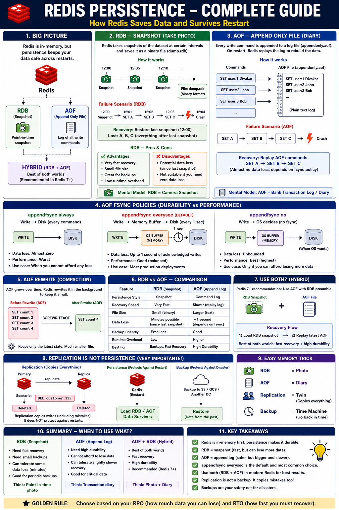

# Redis Persistence: RDB, AOF, and Surviving Restarts

## Introduction

Redis is an **in-memory** store — every key lives in RAM, which is what makes it fast. But RAM
is volatile: a restart, crash, or deploy wipes it. **Persistence** is how Redis writes data to
disk so it can be reloaded on restart and your data survives.

There are two mechanisms — **RDB** (point-in-time snapshots) and **AOF** (a log of every write)
— and you can run either, both, or neither. Choosing well comes down to two numbers:

- **RPO (Recovery Point Objective)** — how much data you can afford to *lose* (seconds? zero?).
- **RTO (Recovery Time Objective)** — how *fast* you must be back up after a restart.

This is a **configuration and operations** topic: the behavior is controlled by `redis.conf`
(or compose flags) and observed with `redis-cli`, not by application code. So this module is a
guide plus runnable config and `redis-cli` walkthroughs.



> **Don't skip:** [AOF fsync policies](#aof-fsync-policies-durability-vs-performance),
> [RDB vs AOF](#rdb-vs-aof), and [Replication is NOT persistence](#replication-is-not-persistence)
> — those three decide your real durability story (and they're the common interview traps).

> **Hands-on:** there's a runnable example below — see
> [Hands-On: Run It and Inspect the Backup Files](#hands-on-run-it-and-inspect-the-backup-files)
> to spin up Redis with persistence and watch the `dump.rdb` / `appendonlydir/` files appear.

## The Big Picture

| | RDB (Snapshot) | AOF (Append Only File) | Hybrid (RDB + AOF) |
|---|---|---|---|
| What it stores | A binary point-in-time dump (`dump.rdb`) | A log of every write command (`appendonly.aof`) | RDB preamble + AOF tail |
| Mental model | **Camera snapshot** | **Bank transaction diary** | **Photo + diary** |
| Recovery speed | Very fast (load one binary) | Slower (replay the log) | Fast (load RDB, then replay recent AOF) |
| Data loss on crash | Everything since the last snapshot | ≤ one fsync interval (policy-dependent) | ≤ one fsync interval |
| Recommended | Backups / periodic | Low data loss | **Default for Redis 7+** |

## RDB — Snapshotting

RDB periodically forks the process and writes the entire dataset to a compact binary file
(`dump.rdb`). A snapshot is triggered by **save points** (after N seconds if at least M keys
changed) or manually.

```conf
# Snapshot if: 1+ change in 900s, 10+ in 300s, or 10000+ in 60s
save 900 1
save 300 10
save 60 10000
dbfilename dump.rdb
dir /data
```

- **`SAVE`** — synchronous; blocks the server while it writes. Almost never used in production.
- **`BGSAVE`** — forks a child process that writes the snapshot in the background while the
  parent keeps serving. This is what save points trigger.

**Copy-on-write fork:** `BGSAVE` relies on the OS `fork()`. The child shares the parent's
memory pages; only pages the parent *modifies* during the save get copied. So a snapshot of a
mostly-read dataset is cheap, but a write-heavy one during save can transiently use up to ~2×
memory.

- **Pros:** very fast recovery, compact single file, great for backups, low runtime overhead.
- **Cons:** **you lose everything written since the last snapshot** if Redis crashes between
  saves. Not for "can't lose a second" workloads.

**Failure scenario:** last snapshot at 12:00; writes A, B, C happen at 12:01–12:03; crash at
12:04 → on restart you have the 12:00 state and **A, B, C are gone**.

## AOF — Append Only File

AOF logs **every write command** to a file. On restart, Redis replays the log to rebuild the
exact dataset.

```conf
appendonly yes
appendfilename "appendonly.aof"
appenddirname "appendonlydir"   # Redis 7+ keeps a multi-part AOF here
appendfsync everysec
```

Because it records each mutation, AOF can be far more durable than RDB — at most you lose the
writes not yet flushed to disk, which the **fsync policy** controls.

- **Pros:** much smaller potential data loss; human-readable log; safer default.
- **Cons:** larger file than RDB; slower recovery (replay vs. binary load); higher runtime I/O.

**Failure scenario:** writes A → B → C, then crash. On restart Redis replays A → B → C —
**almost no loss**, depending on the fsync policy below.

## AOF fsync Policies (Durability vs Performance)

Writing to the AOF goes through an OS buffer; `fsync` is what actually forces it to disk. The
policy is the single most important durability knob:

| `appendfsync` | When it fsyncs | Data loss on crash | Performance |
|---------------|----------------|--------------------|-------------|
| `always` | every write command | ~zero | worst (an fsync per write) |
| `everysec` *(default)* | once per second | up to ~1 second of writes | good — the balanced choice |
| `no` | whenever the OS decides | unbounded (could be many seconds) | best |

Rule of thumb: **`everysec`** for almost everyone. Use `always` only when you truly cannot lose
a single acknowledged write (and can pay the latency); `no` only when you can tolerate losing
several seconds for maximum throughput.

## AOF Rewrite (Compaction)

The AOF grows forever as commands accumulate (`SET count 1`, `SET count 2`, …). **Rewrite**
compacts it by writing a new AOF that reproduces the current dataset with the minimum commands
(just `SET count 4`).

- Triggered automatically by growth thresholds, or manually with **`BGREWRITEAOF`**.

```conf
auto-aof-rewrite-percentage 100   # rewrite when AOF is 2× its last-rewrite size
auto-aof-rewrite-min-size 64mb
```

Like `BGSAVE`, the rewrite runs in a forked child and doesn't block serving.

## RDB vs AOF

| Feature | RDB (Snapshot) | AOF (Append Log) |
|---------|----------------|------------------|
| Persistence style | Snapshot | Command log |
| Recovery speed | Very fast | Slower (replay) |
| File size | Small (binary) | Larger (text) |
| Data loss | Minutes possible (since last snapshot) | ~1s with `everysec` |
| Backup friendliness | Excellent (one file) | Good |
| Runtime overhead | Low | Higher |
| Best for | Backups, fast recovery | High durability |

## Hybrid (RDB + AOF) — recommended

Redis 7+ recommends running **both**, with the AOF using an **RDB preamble**: the AOF's base is
a compact RDB snapshot, followed by the recent commands as a log.

```conf
appendonly yes
appendfsync everysec
aof-use-rdb-preamble yes   # AOF base is an RDB snapshot; tail is the command log
save 900 1                 # also keep periodic RDB snapshots for backups
```

**Recovery flow:** load the RDB snapshot (fast) → replay the recent AOF tail (low loss). You get
**fast recovery *and* high durability** — the best of both.

> Startup precedence: if `appendonly yes`, Redis rebuilds state from the **AOF** (it's the more
> complete record) and ignores `dump.rdb` for loading. The RDB is then mainly your backup
> artifact.

## Recovery: What Happens on Restart

Two separate things — keep them apart:

- **Reloading the data: automatic.** When `redis-server` starts, it loads your data from disk
  before serving traffic — no restore command. AOF is used if enabled (it's the more complete
  record), otherwise `dump.rdb`. While loading, `INFO persistence` shows `loading:1` and Redis
  is unavailable; how long this takes *is* your **RTO** (RDB loads fast; AOF replays slower).
- **Restarting the process: not by itself.** A crashed Redis is just a dead process — something
  external must restart it, and only then does the auto-load run: Docker's
  `restart: unless-stopped` (used here), systemd `Restart=always`, or Kubernetes restarting the
  pod.
- **Damaged file on crash.** A half-written AOF tail is handled by `aof-load-truncated yes`
  (default) — Redis trims the partial last command and starts. If truly corrupt, repair with
  `redis-check-aof --fix` (or `redis-check-rdb`).
- **Recovery ≠ failover.** The above is one node reloading its own disk. To avoid the downtime
  entirely, replication + Sentinel/Cluster promote a replica in seconds instead — a different
  mechanism (see below).

## Replication is NOT Persistence

A very common and dangerous confusion. These solve **different** problems:

| | Protects against | Mechanism |
|---|---|---|
| **Persistence** (RDB/AOF) | process restart / crash | reload from local disk |
| **Replication** | a node going down | a replica keeps a live copy |
| **Backups** | disaster / human error / corruption | copy to S3 / another region, restore from the past |

The trap: **replication copies *everything*, including mistakes.** If you `DEL customer:123`
on the primary, the replica deletes it too — replication won't save you. And if persistence is
off, a full restart of an unreplicated node loses everything. You generally want **all three**:
persistence (survive restart) + replication (survive a node failure) + backups (survive disaster
and human error).

## Configuration Examples

### Compose: enable hybrid persistence with a durable volume

```yaml
services:
  redis:
    image: redis:8.2
    container_name: redis-persistent
    command:
      - redis-server
      - --appendonly
      - "yes"
      - --appendfsync
      - everysec
      - --save
      - "900 1 300 10 60 10000"
    volumes:
      - redis-data:/data          # persist dump.rdb + appendonlydir across restarts
    ports:
      - "6379:6379"

volumes:
  redis-data:
```

### Or mount a `redis.conf`

```yaml
services:
  redis:
    image: redis:8.2
    command: ["redis-server", "/usr/local/etc/redis/redis.conf"]
    volumes:
      - ./redis.conf:/usr/local/etc/redis/redis.conf:ro
      - redis-data:/data
```

```conf
# redis.conf — hybrid persistence
appendonly yes
appendfsync everysec
aof-use-rdb-preamble yes
save 900 1
save 300 10
save 60 10000
dir /data
```

> The **volume matters as much as the config**: without a persistent volume mounted at `dir`
> (`/data`), the files are written inside the container and vanish when it's recreated.

## Hands-On: Run It and Inspect the Backup Files

A ready-to-run `redis.conf` and `compose.persistence.yaml` live **next to this README** in the
persistence module. They start a standalone Redis on port **6380** (so it won't clash with the
main `redis-local` on 6379) with hybrid persistence, and **bind-mount `./data`** so the
generated files appear right on your machine.

```bash
cd src/main/java/io/github/divakar/redisproductioncookbook/features/persistence
docker compose -f compose.persistence.yaml up -d

# Write some data, then force a snapshot so dump.rdb is created now
docker exec redis-persist-demo redis-cli SET order:1 placed
docker exec redis-persist-demo redis-cli SET order:2 shipped
docker exec redis-persist-demo redis-cli BGSAVE

# Inspect the files Redis just created — on your host, in ./data
ls -la data
ls -la data/appendonlydir
```

You'll see the snapshot and the multi-part AOF:

```text
data/
  dump.rdb                          # the RDB snapshot
  appendonlydir/
    appendonly.aof.1.base.rdb       # AOF base (RDB preamble)
    appendonly.aof.1.incr.aof       # AOF tail: recent write commands (human-readable)
    appendonly.aof.manifest         # lists the AOF parts
```

Peek inside the AOF tail — it's the RESP command protocol (verbose, but you can read your
writes in it):

```bash
cat data/appendonlydir/appendonly.aof.*.incr.aof
```

```text
*2
$6
SELECT
$1
0
*3
$3
SET
$7
order:1
$6
placed
...
```

Each `*N` is a command with `N` arguments, and each `$L` is the byte length of the next
argument — so `SET order:1 placed` is right there, just framed by the protocol.

Prove it survives a restart, then clean up:

```bash
docker compose -f compose.persistence.yaml restart
docker exec redis-persist-demo redis-cli GET order:1   # "placed" — reloaded from disk

docker compose -f compose.persistence.yaml down        # keeps ./data
# rm -rf data                                           # wipe the generated files
```

> The `./data` directory is git-ignored, so the generated backup files won't be committed.

## Operating Persistence (`redis-cli`)

```bash
# Inspect everything about persistence state
docker exec redis-local redis-cli INFO persistence

# What's configured?
docker exec redis-local redis-cli CONFIG GET save
docker exec redis-local redis-cli CONFIG GET appendonly
docker exec redis-local redis-cli CONFIG GET appendfsync

# Trigger a snapshot / AOF rewrite in the background
docker exec redis-local redis-cli BGSAVE
docker exec redis-local redis-cli BGREWRITEAOF

# When did the last successful save happen? (unix timestamp)
docker exec redis-local redis-cli LASTSAVE

# Turn AOF on at runtime (also persists going forward)
docker exec redis-local redis-cli CONFIG SET appendonly yes
```

Key fields in `INFO persistence` to know:

| Field | Meaning |
|-------|---------|
| `rdb_changes_since_last_save` | writes not yet captured in a snapshot (your RDB-only exposure) |
| `rdb_last_save_time` | timestamp of the last successful RDB save |
| `rdb_last_bgsave_status` | `ok` / `err` for the last `BGSAVE` |
| `aof_enabled` | `1` if AOF is on |
| `aof_last_write_status` | `ok` / `err` for the last AOF write |
| `aof_last_bgrewrite_status` | `ok` / `err` for the last rewrite |
| `loading` | `1` while Redis is reloading data on startup |

### Try it: see RDB lose data, AOF keep it

```bash
# RDB-only: write, kill WITHOUT a save, restart -> the write is gone
docker exec redis-local redis-cli CONFIG SET appendonly no
docker exec redis-local redis-cli SET demo:key "before-crash"
docker kill redis-local                 # ungraceful: no save on exit
docker start redis-local
docker exec redis-local redis-cli GET demo:key   # (nil) if it was never snapshotted

# With AOF everysec: the same sequence survives (replayed from the log)
docker exec redis-local redis-cli CONFIG SET appendonly yes
docker exec redis-local redis-cli SET demo:key "before-crash"
docker kill redis-local
docker start redis-local
docker exec redis-local redis-cli GET demo:key   # "before-crash"
```

## Fork & Memory Considerations

- **Snapshots and rewrites `fork()`.** On large datasets the fork itself can cause a brief
  latency spike, and copy-on-write can spike memory if the write rate is high during the save.
- **Allow memory overcommit** (`vm.overcommit_memory = 1`) so `fork()`/`BGSAVE` don't fail under
  memory pressure.
- **Disable Transparent Huge Pages (THP)** — they make COW copies larger and increase latency;
  Redis warns about this at startup.
- Watch `rdb_last_bgsave_status` / `aof_last_bgrewrite_status` for failures (often disk-full or
  fork-failed).

## Golden Rule

**Choose based on your RPO and RTO.**

- Can lose minutes, want fast recovery and easy backups → **RDB**.
- Can't lose more than ~a second → **AOF (`everysec`)**.
- Want both fast recovery and low loss → **Hybrid (RDB + AOF)** — the modern default.
- Need zero acknowledged-write loss → **AOF `always`** (and accept the latency).

## Production Considerations

- **Run hybrid (AOF `everysec` + periodic RDB)** unless you have a specific reason not to.
- **Mount a durable volume** at `dir`; persistence to an ephemeral container disk is no
  persistence at all.
- **Back up the RDB off-box** (S3/GCS/another region) — persistence protects against restart,
  not disaster or `FLUSHALL`.
- **Size memory for fork/COW** and enable overcommit; alert on failed background saves.
- **Persistence ≠ HA.** Pair it with replication (and Sentinel/Cluster) for node failure, and
  with backups for human error.
- **On managed Redis (ElastiCache)** you choose snapshot/AOF settings and backup windows rather
  than editing `redis.conf` directly — same concepts, different controls.

## Interview Notes

**What persistence options does Redis have?**

RDB (point-in-time binary snapshots), AOF (a log of every write replayed on restart), both
together (hybrid, with an RDB preamble inside the AOF), or none.

**RDB vs AOF — trade-off?**

RDB is fast to load and compact (great for backups) but can lose everything since the last
snapshot. AOF loses at most ~one fsync interval and is more durable, but the file is larger and
recovery is slower. Hybrid gives fast recovery *and* low loss.

**What do the `appendfsync` policies mean?**

`always` fsyncs every write (≈zero loss, slowest), `everysec` fsyncs once a second (≤1s loss,
balanced default), `no` lets the OS decide (fastest, unbounded loss).

**Is `BGSAVE` blocking?**

No — it forks a child that writes the snapshot while the parent keeps serving. `SAVE` is the
blocking variant and is avoided in production. The fork uses copy-on-write.

**Does replication make persistence unnecessary?**

No. Replication copies data to other nodes (including mistakes like deletes) and protects
against node failure, not restart. Persistence protects against restart; backups protect
against disaster/human error. You typically want all three.

**Which file does Redis load on startup?**

If AOF is enabled, it rebuilds from the AOF (the more complete record); otherwise it loads
`dump.rdb`.

**How do you reason about which to use?**

By RPO (acceptable data loss) and RTO (acceptable recovery time): tighter RPO pushes you toward
AOF/`always`; the desire for fast recovery and simple backups keeps RDB in the mix — hence
hybrid as the common answer.
