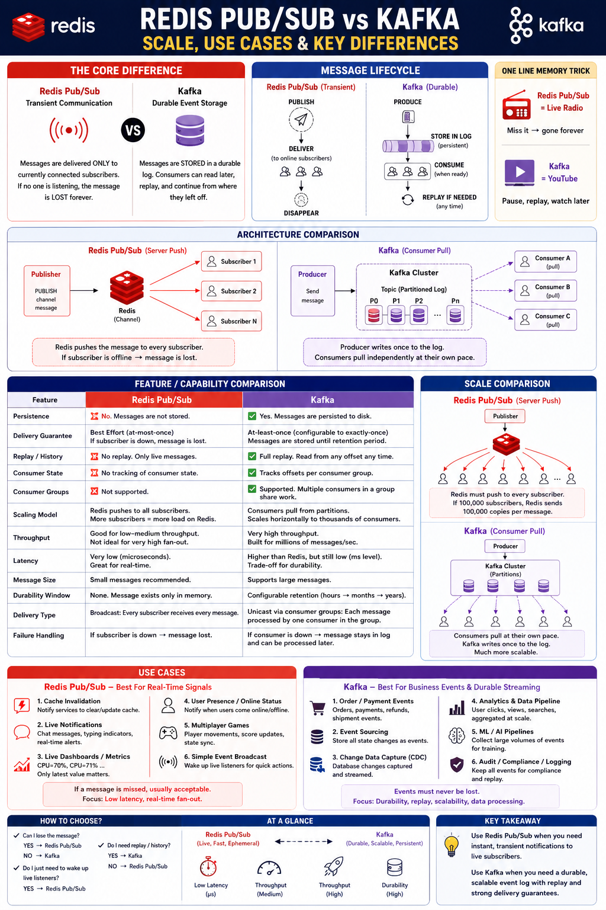

# Redis Pub/Sub: Real-Time Notifications Broadcast

## Introduction

This module implements a production-style real-time notifications broadcaster with
Spring Boot and Spring Data Redis. A publisher sends a message to a Redis channel, and
every application instance subscribed to that channel receives it instantly and fans it
out to its own connected clients.

Redis Pub/Sub is **fire-and-forget, at-most-once** messaging. A message is delivered
only to subscribers that are connected at the moment it is published. If no one is
listening, the message is gone forever. This module embraces that model: it is built for
low-latency, transient, real-time signals — not for durable event storage.

Each received message is kept in a small bounded in-memory buffer so a REST endpoint can
show what subscribers actually received, making the delivery behaviour observable.

> **Wondering when to use Redis Pub/Sub instead of Kafka?** See the
> [Redis Pub/Sub vs Kafka](#redis-pubsub-vs-kafka) comparison below for a side-by-side
> breakdown of durability, replay, consumer groups, and delivery guarantees.

## Why Redis Pub/Sub?

Redis Pub/Sub decouples publishers from subscribers through named **channels**. A
publisher does not know or care who is listening; subscribers do not know who published.
Redis pushes each message to all currently connected subscribers of the channel.

It shines when:

- Messages are **transient real-time signals** (notifications, presence, live updates)
- **Low latency** matters (delivery is microsecond-to-millisecond range)
- A **broadcast / fan-out** pattern is needed — every subscriber gets every message
- Losing an occasional message during a disconnect is acceptable

This module uses Pub/Sub to broadcast notifications to all application instances so that,
for example, a horizontally scaled WebSocket layer can push the same update to every
connected user regardless of which instance they are pinned to.

## Why Not Database Polling?

A common alternative for "real-time" notifications is writing rows to a relational
database and having each application instance poll for new ones. With an indexed
`created_at` and a cursor this is durable, replayable, and queryable.

Redis Pub/Sub becomes attractive when:

- Updates must reach subscribers **immediately**, not on the next poll interval
- Polling load on the database is undesirable at scale
- The signal is **ephemeral** — once delivered it has no further value
- Fan-out to many instances should not multiply database reads

The trade-off is that Pub/Sub provides **no persistence, no replay, and no delivery
guarantee**. Redis is not a replacement for a durable store. Many production systems use
both: the database (or a Redis Stream) remains the source of truth for history, while
Pub/Sub delivers the live "something changed" signal.

For durable, replayable, consumer-group messaging, use **Redis Streams** or **Kafka**
instead — see the comparison below.

## Channel Design

Pub/Sub addresses **channels**, not keys. There is no stored key and no TTL; a channel
exists only while it has publishers or subscribers.

```text
notifications:realtime           # global broadcast channel (all instances)
notifications:user:{userId}      # per-user channel for targeted delivery
notifications:*                  # pattern subscription (PSUBSCRIBE) across all channels
```

Each message is a JSON-serialized `Notification` containing `id`, `channel`, `type`,
`message`, and `publishedAt`. Keeping a structured payload lets subscribers route or
filter without re-parsing free text.

## Architecture

```text
                         HTTP requests
                              |
                              v
                 +--------------------------+
                 |  NotificationController   |
                 +--------------------------+
                              |
                              v
                 +--------------------------+
                 |  NotificationPublisher    |   convertAndSend(channel, payload)
                 +--------------------------+
                              |
                              v
                 +--------------------------+
                 |   Redis Channel           |
                 |   notifications:realtime  |
                 +--------------------------+
                       |                |
            broadcast  |                |  broadcast
        (own conn)     v                v   (own conn)
     +--------------------------+   +--------------------------+
     | WebSocketPushSubscriber  |   | AuditLogSubscriber       |
     | own listener container   |   | own listener container   |
     | -> recent buffer         |   | -> recent buffer         |
     | -> push to WS clients    |   | -> write audit entry     |
     +--------------------------+   +--------------------------+
```

This module runs **two independent subscribers**, each with its **own**
`RedisMessageListenerContainer` (and therefore its own Redis connection). They model two
distinct concerns reacting to the same event: one would push to connected WebSocket
clients, the other records an audit entry. Because each holds a separate connection,
Redis counts them as two subscribers (`PUBSUB NUMSUB` reports `2`), and a single
`PUBLISH` returns `2` — the broadcast fan-out is directly observable.

Publishing is a single `PUBLISH`. Redis pushes the message to **every** subscriber. The
same mechanism fans out across horizontally scaled **app instances** in production: every
instance subscribed to the channel receives its own copy. If a subscriber is down when
the message is published, it never receives that message.

## How Clients Connect

There are two distinct hops in this design, and only the first one is Redis.

The application connects to Redis over a **persistent, long-lived TCP connection**
speaking RESP (the Redis serialization protocol), normally on port `6379` (or TLS on
`6380`). It is **not** WebSocket and not HTTP. The connection is opened once and reused
for many commands rather than reopened per request.

```text
Browser / mobile ──WebSocket or SSE──► App instance ──TCP / RESP──► Redis
   (real-time to the end user)                       (real-time within the backend)
```

| Hop | Protocol | Connection style |
|-----|----------|------------------|
| App ↔ Redis | RESP over TCP (optionally TLS) | Persistent and pooled |
| Browser ↔ App | WebSocket / SSE / HTTP | Persistent (WS/SSE) or per-request (HTTP) |

For normal commands the client library keeps a **pool** of TCP connections (Spring
Boot's default Lettuce client multiplexes one connection across threads; Jedis borrows
one per operation). Pub/Sub is a special case: when a connection issues `SUBSCRIBE` it
**switches into subscriber mode** and can only receive pushed messages until it
unsubscribes. Spring's `RedisMessageListenerContainer` therefore holds a **dedicated,
blocking, long-lived connection** for the subscription, while `PUBLISH` uses a separate
connection from the pool. This module gives **each** subscriber its own container, so it
opens **two** dedicated subscription connections.

```text
App instance
 ├─ pooled connections ─► normal commands (PUBLISH, GET, SET, ...)
 ├─ dedicated conn #1   ─► SUBSCRIBE (WebSocketPushSubscriber)
 └─ dedicated conn #2   ─► SUBSCRIBE (AuditLogSubscriber)
```

WebSocket (or SSE) lives only on the second hop — between the end user and the
application. Redis fans a message out to every app instance over TCP, and each instance
fans it out to its own connected users over WebSocket. That is what makes Pub/Sub useful
for horizontally scaled real-time delivery.

## Redis Commands

| Command | Purpose in this module |
|---------|------------------------|
| `PUBLISH` | Send a notification to a channel |
| `SUBSCRIBE` | Listen on one or more exact channels |
| `UNSUBSCRIBE` | Stop listening on exact channels |
| `PSUBSCRIBE` | Subscribe to channels by pattern, e.g. `notifications:*` |
| `PUNSUBSCRIBE` | Stop a pattern subscription |
| `PUBSUB CHANNELS` | List active channels with subscribers |
| `PUBSUB NUMSUB` | Count subscribers per channel |
| `SPUBLISH` / `SSUBSCRIBE` | Sharded Pub/Sub (Redis 7+) for Cluster — slot-routed |

### Example Commands

Publish a notification:

```redis
PUBLISH notifications:realtime "{\"type\":\"PRESENCE_CHANGED\",\"message\":\"user-123 is online\"}"
```

Subscribe to the broadcast channel:

```redis
SUBSCRIBE notifications:realtime
```

Subscribe to every notification channel by pattern:

```redis
PSUBSCRIBE notifications:*
```

Inspect active channels and subscriber counts:

```redis
PUBSUB CHANNELS notifications:*
PUBSUB NUMSUB notifications:realtime
```

## Time Complexity

| Operation | Complexity |
|-----------|------------|
| `PUBLISH` | `O(N + M)` |
| `SUBSCRIBE` | `O(1)` per channel |
| `UNSUBSCRIBE` | `O(1)` per channel |
| `PSUBSCRIBE` | `O(1)` per pattern |
| `PUBSUB CHANNELS` | `O(N)` |

`N` is the number of subscribers receiving the message and `M` is the number of pattern
subscriptions checked. The cost of a publish grows with the size of the fan-out.

## Common Use Cases

- Real-time notifications and alerts
- Live presence and online/offline status
- Cache invalidation broadcasts across instances
- Chat messages and typing indicators
- Live dashboards and metrics
- Configuration and feature-flag change signals

These all share the same shape: a transient signal that is valuable **now** and
acceptable to miss if a subscriber is momentarily disconnected.

## How Redis Pub/Sub Works Internally

Redis maintains a map of channels to subscribed client connections, plus a separate list
of pattern subscriptions. On `PUBLISH`, Redis iterates the channel's subscribers and the
matching patterns and writes the message to each client's output buffer immediately —
there is no queue, no log, and no acknowledgement.

Consequences that define the model:

- **No persistence.** The message exists only in flight. Nothing is stored.
- **At-most-once delivery.** Connected subscribers get it once; disconnected ones never do.
- **No consumer state.** Redis tracks no offsets, cursors, or consumer groups.
- **No backpressure to the publisher.** A slow subscriber fills its output buffer and may
  be disconnected once `client-output-buffer-limit` for pub/sub is exceeded.

## Cluster Considerations

Classic Pub/Sub is **not** hash-slot routed. To make a channel reachable from any node, a
`PUBLISH` is **propagated to every node** in the cluster. This works transparently but
means publish traffic scales with cluster size, which can become a bottleneck on large
clusters with high publish rates.

Redis 7 introduced **Sharded Pub/Sub** (`SPUBLISH` / `SSUBSCRIBE`). A sharded channel is
mapped to a hash slot like a normal key, so its messages stay on the owning shard and are
not broadcast cluster-wide. This scales far better but requires subscribers to connect to
the shard that owns the channel.

```text
Classic PUBLISH        -> propagated to ALL cluster nodes (not slot-routed)
Sharded SPUBLISH (7+)  -> stays on the slot/shard owning the channel
```

## Scaling Strategies

- **Fan-out cost.** Every subscriber receives a full copy, so `PUBLISH` is `O(N)` in
  subscribers. For very large fan-out, prefer fewer, well-scoped channels over one giant
  channel, and consider Sharded Pub/Sub to bound propagation.
- **Channel granularity.** Split broad channels into targeted ones
  (`notifications:user:{userId}`) so instances only receive what they need.
- **Slow subscribers.** A subscriber that cannot keep up is disconnected to protect the
  server. Keep listener work fast; hand off heavy processing to a worker.
- **Durability needs.** If consumers must be able to reconnect and replay missed messages,
  Pub/Sub is the wrong tool — move that path to Redis Streams or Kafka.

## Run Example

Start Redis and the application:

```bash
docker compose up -d
./gradlew bootRun
```

The application expects Redis on `localhost:6379` unless connection properties are
overridden. On startup both subscribers (`websocket-push` and `audit-log`) subscribe to
`notifications:realtime`, each on its own connection, so `PUBSUB NUMSUB` reports `2`.

## curl Examples

Publish a notification:

```bash
curl -i -X POST http://localhost:8080/api/notifications/publish \
  -H 'Content-Type: application/json' \
  -d '{"channel":"notifications:realtime","type":"PRESENCE_CHANGED","message":"user-123 is online"}'
```

Response:

```json
{
  "id": "b1f2c3d4",
  "channel": "notifications:realtime",
  "type": "PRESENCE_CHANGED",
  "message": "user-123 is online",
  "publishedAt": "2026-06-28T05:00:00Z",
  "subscribersNotified": 2
}
```

Read what each subscriber has received (from its bounded buffer). Because the message is
broadcast, both subscribers report the same notification — proof of fan-out:

```bash
curl http://localhost:8080/api/notifications/received
```

Response:

```json
[
  {
    "subscriber": "websocket-push",
    "received": [
      {
        "id": "b1f2c3d4",
        "channel": "notifications:realtime",
        "type": "PRESENCE_CHANGED",
        "message": "user-123 is online",
        "publishedAt": "2026-06-28T05:00:00Z"
      }
    ]
  },
  {
    "subscriber": "audit-log",
    "received": [
      {
        "id": "b1f2c3d4",
        "channel": "notifications:realtime",
        "type": "PRESENCE_CHANGED",
        "message": "user-123 is online",
        "publishedAt": "2026-06-28T05:00:00Z"
      }
    ]
  }
]
```

Publish and watch delivery directly in Redis:

```bash
# In one terminal, subscribe:
docker exec -it redis-local redis-cli SUBSCRIBE notifications:realtime

# In another terminal, publish:
docker exec redis-local redis-cli PUBLISH notifications:realtime "hello subscribers"
```

Inspect channel activity:

```bash
docker exec redis-local redis-cli PUBSUB CHANNELS 'notifications:*'
docker exec redis-local redis-cli PUBSUB NUMSUB notifications:realtime
```

## Redis Pub/Sub vs Kafka



Redis Pub/Sub and Kafka are often compared but solve different problems. The core
difference is **transient delivery vs durable storage**.

| Aspect | Redis Pub/Sub | Kafka |
|--------|---------------|-------|
| Persistence | None — messages are not stored | Messages persisted to disk |
| Delivery guarantee | At-most-once (lost if subscriber is down) | At-least-once, configurable |
| Replay / history | No replay | Full replay from any offset |
| Consumer state | None tracked | Tracks offsets per consumer |
| Consumer groups | Not supported | Supported (work sharing in a group) |
| Delivery model | Broadcast — every subscriber gets every message | Unicast via consumer group |
| Throughput | Good (low–medium fan-out) | Very high (millions/sec) |
| Latency | Very low (microseconds) | Low (ms level) |
| Failure handling | Subscriber down → message lost | Consumer down → message waits in log |

Choose **Redis Pub/Sub** for instant, transient, real-time signals where an occasional
miss is acceptable (notifications, presence, cache invalidation). Choose **Kafka** (or
Redis Streams for a lighter option) when you need a durable, replayable event log with
strong delivery guarantees and consumer groups.

One-line memory trick from the diagram: **Redis Pub/Sub is live radio — miss it and it is
gone forever; Kafka is YouTube — pause, replay, watch later.**

## Production Considerations

- **Accept at-most-once.** Design consumers to tolerate missed messages, or use Streams
  for the paths that cannot lose data.
- **Keep listeners fast.** Heavy work inside a `MessageListener` slows delivery and risks
  the subscriber being dropped for a full output buffer.
- **Bound buffers.** Tune `client-output-buffer-limit pubsub` and the application-side
  received buffer so a burst cannot exhaust memory.
- **Scope channels.** Use targeted channels to limit fan-out and avoid one hot broadcast
  channel becoming a bottleneck.
- **Secure channels.** Use Redis ACLs to restrict which clients may publish or subscribe
  to which channel patterns.
- **Cluster topology.** Understand that classic `PUBLISH` is broadcast cluster-wide;
  evaluate Sharded Pub/Sub for high-rate workloads on large clusters.
- **Observe.** Monitor `PUBSUB NUMSUB`, connected clients, output-buffer evictions, and
  delivery latency. There is no built-in lag metric because there is no log.
- **Apply** authentication, TLS, timeouts, and bounded reconnect/retry on the subscriber
  connection so listeners recover after a Redis restart or failover.

## Interview Notes

**What delivery guarantee does Redis Pub/Sub provide?**

At-most-once. A message reaches only the subscribers connected at publish time; there is
no persistence, acknowledgement, or replay.

**What happens if a message is published with no subscribers?**

It is discarded. Redis does not store it, so a subscriber that connects later cannot
receive it.

**How is Pub/Sub different from Redis Streams?**

Streams persist messages in an append-only log with consumer groups, offsets, and replay.
Pub/Sub is transient broadcast with none of that. Use Streams when consumers must
reconnect and resume; use Pub/Sub for ephemeral real-time fan-out.

**Does Pub/Sub support consumer groups / load balancing?**

No. Every subscriber to a channel receives every message (broadcast). Work-sharing across
a group requires Streams or Kafka.

**How does Pub/Sub behave in Redis Cluster?**

Classic `PUBLISH` is propagated to all nodes, so any node can reach any subscriber but
publish cost grows with cluster size. Redis 7+ Sharded Pub/Sub (`SPUBLISH`/`SSUBSCRIBE`)
routes by hash slot to keep messages on the owning shard.

**What is the complexity of `PUBLISH`?**

`O(N + M)`, where `N` is the number of subscribers and `M` is the number of pattern
subscriptions checked.

**When would you choose Kafka over Redis Pub/Sub?**

When you need durability, replay, ordered partitioned logs, consumer groups, or
at-least-once/exactly-once semantics. Pub/Sub is for low-latency transient signals, not a
durable event backbone.
