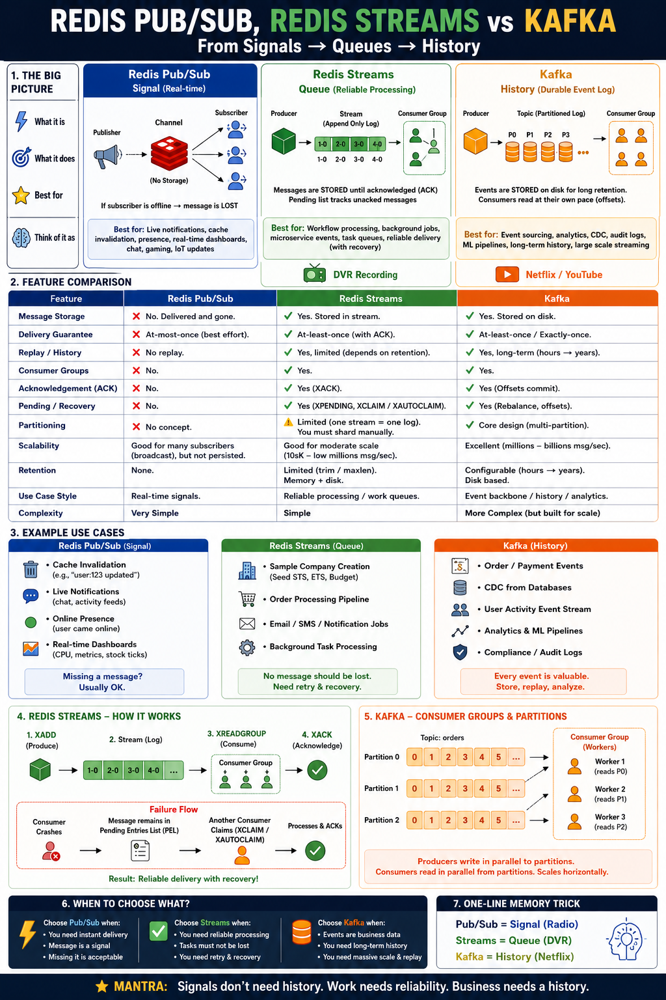

# Redis Streams: Reliable Order Event Processing

## Introduction

This module implements a production-style, **reliable event processing pipeline** with
Spring Boot and Spring Data Redis. A producer appends order events to a Redis **Stream**
(an append-only log), and a **consumer group** of workers processes each event exactly
once, acknowledges it, and recovers any event a crashed worker left unprocessed.

Redis Streams is **durable, replayable, at-least-once** messaging. Unlike Pub/Sub, an
event is **stored** in the log until it is trimmed, so a consumer that was down can come
back and resume from where it left off. The stream also tracks per-group delivery state
(offsets) and a **Pending Entries List (PEL)** of delivered-but-unacknowledged messages,
which is what makes reliable recovery possible.

This module uses order events on purpose: orders and payments carry business value and
**must not be lost**. That is exactly the workload Pub/Sub is wrong for and Streams is
built for.

> **Pub/Sub vs Streams vs Kafka?** See the
> [Pub/Sub vs Streams vs Kafka](#pubsub-vs-streams-vs-kafka) comparison below for a
> side-by-side breakdown of storage, delivery guarantees, replay, consumer groups, and
> recovery. The one-line version: **signals don't need history, work needs reliability,
> business needs a full history.**

## Why Redis Streams?

A Redis Stream is an **append-only log** of entries, each with a unique, time-ordered ID
(`<millisecondsTime>-<sequence>`). Producers append with `XADD`; consumers read ranges or
subscribe via consumer groups. Compared with the other messaging tools in this cookbook:

- **vs Pub/Sub** — Pub/Sub is fire-and-forget broadcast with no storage. Streams persist
  every entry, support replay, and guarantee at-least-once delivery with acknowledgements.
- **vs a List used as a queue** (`LPUSH`/`BRPOP`) — a List pops the element off; once
  taken it is gone, there is no acknowledgement, no replay, and no way to share work
  across a group while tracking who processed what. Streams add consumer groups, the PEL,
  and recovery on top of the log.

Streams shine when:

- Every message **must be processed** (orders, payments, jobs, CDC, audit trails)
- Multiple workers should **share the load** — each message handled by exactly one worker
- Consumers must be able to **reconnect and resume** without losing un-processed messages
- You want a **bounded, in-memory-fast** log without standing up Kafka

## Why Not Pub/Sub or a List Queue?

| Need | Pub/Sub | List queue | Redis Streams |
|------|---------|------------|---------------|
| Message stored after delivery | No | No (popped) | **Yes** (until trimmed) |
| Replay / history | No | No | **Yes** (`XRANGE`, re-read) |
| Consumer groups (work sharing) | No | Manual / fragile | **Yes** (`XREADGROUP`) |
| Acknowledgement | No | No | **Yes** (`XACK`) |
| Recover a crashed consumer's work | No | No | **Yes** (`XPENDING`/`XCLAIM`/`XAUTOCLAIM`) |
| Delivery guarantee | At-most-once | At-most-once | **At-least-once** |

If an occasional miss is fine (presence, live dashboards), Pub/Sub is simpler and lighter.
If the data must survive a consumer restart, Streams is the right tool.

## Stream & Consumer Group Design

A Stream is addressed by a normal Redis **key**. Consumer state lives inside the stream as
named **groups**, each with named **consumers**.

```text
orders:events                    # the stream (append-only log of order events)
└── group: order-processors      # one consumer group sharing the work
    ├── consumer: worker-1        # competing consumer (gets some entries)
    └── consumer: worker-2        # competing consumer (gets the others)
```

Key facts about the design:

- **One group, many consumers = competing consumers.** Within a group, each new entry is
  delivered to **exactly one** consumer. Add workers to scale throughput.
- **Multiple groups = independent fan-out.** A second group (e.g. `analytics`) would get
  its *own* independent copy of every entry, each tracked separately. This module uses one
  group to demonstrate work-sharing.
- Each entry is a flat map of fields. This module stores a JSON `payload` field plus a
  `type` field so consumers can route without re-parsing.

> **Contrast with the Pub/Sub module:** there, two subscribers each received *every*
> message (broadcast). Here, two workers in one group **split** the messages — each event
> is processed once. Same "two consumers", opposite delivery model.

## Architecture

```text
                         HTTP requests
                              |
                              v
                 +--------------------------+
                 |   OrderEventController     |
                 +--------------------------+
                              |
                              v
                 +--------------------------+
                 |   OrderEventProducer       |   XADD orders:events * type ... payload ...
                 +--------------------------+
                              |
                              v
                 +-------------------------------------------+
                 |   Redis Stream: orders:events             |
                 |   [1-0][2-0][3-0][4-0][5-0] ... (log)     |
                 +-------------------------------------------+
                              | consumer group: order-processors
              XREADGROUP >    |        (each entry to exactly one worker)
                       +------+------+
                       v             v
            +------------------+  +------------------+
            | worker-1         |  | worker-2         |
            | process -> XACK  |  | process -> XACK  |
            +------------------+  +------------------+
                       \             /
                        v           v
            +-------------------------------------------+
            | Pending Entries List (PEL)                |
            | delivered but not yet XACK'd              |
            +-------------------------------------------+
                              ^
                              | XAUTOCLAIM (idle > threshold)
                 +--------------------------+
                 |   PendingEventRecovery     |  reclaims a crashed worker's entries
                 +--------------------------+
```

Flow:

1. `XADD` appends an entry and returns its generated ID (`<ms>-<seq>`).
2. Each worker calls `XREADGROUP ... STREAMS orders:events >` to claim **new** entries.
   The entry immediately enters the group's **PEL** for that consumer.
3. On success the worker `XACK`s the entry, removing it from the PEL.
4. If a worker crashes before `XACK`, the entry stays in the PEL. `XAUTOCLAIM` reassigns
   entries idle longer than a threshold to a live worker, which reprocesses and acks them.

This is the **at-least-once** contract: an entry is delivered until someone acknowledges
it, so a handler may see the same entry twice and must be **idempotent**.

## Redis Commands

| Command | Purpose in this module |
|---------|------------------------|
| `XADD` | Append an order event to the stream |
| `XLEN` | Number of entries in the stream |
| `XRANGE` / `XREVRANGE` | Read entries by ID range (history / inspection) |
| `XGROUP CREATE` | Create the `order-processors` group (with `MKSTREAM`) |
| `XREADGROUP` | A worker reads new (`>`) or its own pending entries |
| `XACK` | Acknowledge an entry as processed (removes it from the PEL) |
| `XPENDING` | Inspect delivered-but-unacknowledged entries |
| `XCLAIM` | Reassign a specific pending entry to another consumer |
| `XAUTOCLAIM` | Scan and reclaim idle pending entries in bulk (Redis 6.2+) |
| `XINFO STREAM/GROUPS/CONSUMERS` | Introspect stream and group state |
| `XTRIM` / `XADD ... MAXLEN` | Cap the log length to bound memory |
| `XDEL` | Delete a specific entry |

### Example Commands

Append an order event (server generates the ID with `*`):

```redis
XADD orders:events * type ORDER_PLACED payload "{\"orderId\":\"o-1\",\"amount\":42.0}"
```

Create the consumer group, creating the stream if needed, reading only new messages (`$`):

```redis
XGROUP CREATE orders:events order-processors $ MKSTREAM
```

A worker reads up to 10 new entries, blocking up to 2s:

```redis
XREADGROUP GROUP order-processors worker-1 COUNT 10 BLOCK 2000 STREAMS orders:events >
```

Acknowledge a processed entry:

```redis
XACK orders:events order-processors 1718000000000-0
```

Inspect pending work and reclaim entries idle for over 30s:

```redis
XPENDING orders:events order-processors
XAUTOCLAIM orders:events order-processors worker-2 30000 0
```

## Time Complexity

| Operation | Complexity |
|-----------|------------|
| `XADD` | `O(1)` (amortized; `~MAXLEN` trimming is near `O(1)`) |
| `XLEN` | `O(1)` |
| `XRANGE` / `XREVRANGE` | `O(N)` for the `N` entries returned |
| `XREADGROUP` | `O(N)` for the `N` entries returned |
| `XACK` | `O(1)` per acknowledged ID |
| `XDEL` | `O(1)` per ID |
| `XPENDING` (summary) | `O(1)`; extended form `O(N)` |
| `XCLAIM` / `XAUTOCLAIM` | `O(N)` for the entries claimed |

The append-only log gives `O(1)` writes; reads cost only what they return.

## Common Use Cases

- Order / payment / fulfilment pipelines that must not drop events
- Background job and task queues with reliable retry
- Microservice event propagation (one stream, several consumer groups)
- Change Data Capture (CDC) and outbox-pattern delivery
- Audit trails and event sourcing where history must be retained
- Buffering high-volume ingestion before batch processing

These share one shape: **every message matters**, and consumers must be able to fail and
resume without losing work.

## How Redis Streams Works Internally

A Stream is stored as a **radix tree (rax)** of entries keyed by ID, with entries packed
into listpack nodes for memory efficiency. Each entry ID is `<ms>-<seq>`, strictly
increasing, so the log is naturally time-ordered and supports range queries.

Per consumer group, Redis tracks:

- **`last-delivered-id`** — the high-water mark of entries handed out to the group. A read
  with `>` returns entries after this ID and advances it.
- **The Pending Entries List (PEL)** — every entry delivered to a consumer but not yet
  `XACK`'d, with the owning consumer, delivery time, and delivery count. This is the heart
  of reliable delivery: nothing leaves the PEL until acknowledged.

Consequences that define the model:

- **At-least-once delivery.** An unacknowledged entry is redelivered (via claim), so
  handlers must be idempotent.
- **Durable + replayable.** Entries persist until trimmed; any group/range can re-read.
- **Bounded by design.** Without trimming the log grows forever — use `MAXLEN`/`MINID`.
- **PEL growth is a signal.** A growing PEL means consumers are failing to ack (slow,
  crashing, or buggy handlers).

## Cluster Considerations

A Stream is a **single key**, so it lives entirely on **one hash slot / shard**. All
reads, writes, and group state for that stream are served by the owning node. This keeps
ordering and group semantics simple, but a single stream cannot exceed one shard's
capacity.

To scale beyond one shard, **partition across multiple streams** (e.g.
`orders:events:{0}`..`orders:events:{N}`) and route by a key such as `orderId`, mirroring
Kafka partitions. Each partition stream is independent and can live on a different shard.

```text
orders:events:{0}  -> shard A   (orders hashed to partition 0)
orders:events:{1}  -> shard B   (orders hashed to partition 1)
orders:events:{2}  -> shard C   (orders hashed to partition 2)
```

## Scaling Strategies

- **Add consumers to a group** to raise throughput — each entry still goes to exactly one
  consumer, so workers share the load.
- **Partition into multiple streams** when one stream saturates a shard; route by key to
  preserve per-key ordering.
- **Trim aggressively** with `XADD ... MAXLEN ~ N` or `XTRIM ... MINID` to bound memory;
  the `~` (approximate) form is far cheaper.
- **Tune batch + block.** Larger `COUNT` amortizes round-trips; a `BLOCK` timeout avoids
  busy-looping while staying responsive.
- **Watch the PEL.** Alert on pending count and max idle time; reclaim with `XAUTOCLAIM`
  and send poison messages to a dead-letter stream after N delivery attempts.

## Run Example

Start Redis and the application:

```bash
docker compose up -d
./gradlew bootRun
```

The application expects Redis on `localhost:6379` unless connection properties are
overridden. On startup it creates the `order-processors` group on `orders:events` (with
`MKSTREAM`) and starts two workers (`worker-1`, `worker-2`) that share the stream.

## curl Examples

Publish an order event:

```bash
curl -i -X POST http://localhost:8080/api/order-events \
  -H 'Content-Type: application/json' \
  -d '{"orderId":"order-123","type":"ORDER_PLACED","amount":42.50,"customer":"alice"}'
```

Response (the generated stream entry ID is returned):

```json
{
  "entryId": "1718000000000-0",
  "orderId": "order-123",
  "type": "ORDER_PLACED",
  "amount": 42.50,
  "customer": "alice",
  "occurredAt": "2026-06-28T11:30:00Z"
}
```

See which worker processed what (proof the group split the work):

```bash
curl http://localhost:8080/api/order-events/processed
```

```json
[
  { "consumer": "worker-1", "processed": [ { "entryId": "1718000000000-0", "orderId": "order-123", "type": "ORDER_PLACED" } ] },
  { "consumer": "worker-2", "processed": [ { "entryId": "1718000000500-0", "orderId": "order-124", "type": "PAYMENT_RECEIVED" } ] }
]
```

Inspect recent stream entries and pending (unacknowledged) work:

```bash
curl http://localhost:8080/api/order-events/recent
curl http://localhost:8080/api/order-events/pending
```

Drive it directly in Redis:

```bash
# Append an event:
docker exec redis-local redis-cli XADD orders:events '*' type ORDER_PLACED payload '{"orderId":"o-9"}'

# Inspect the stream and group:
docker exec redis-local redis-cli XLEN orders:events
docker exec redis-local redis-cli XINFO GROUPS orders:events
docker exec redis-local redis-cli XPENDING orders:events order-processors
```

## Break It Yourself: Crash & Recovery

The whole point of Streams over Pub/Sub is that a crashed worker **does not lose work**. You
can trigger and observe that recovery end-to-end with one flag.

Publishing with `"failFirstAttempt": true` makes the first worker that picks up the entry
throw **before** it acknowledges — simulating a process that dies mid-job. The entry then
stays in the Pending Entries List until `PendingEventRecovery` reclaims it (entries idle
longer than 30s, scanned every 10s) and reprocesses it under the `recovery` consumer.

```bash
# 1. Publish an event that will fail on its first processing attempt:
curl -i -X POST http://localhost:8080/api/order-events \
  -H 'Content-Type: application/json' \
  -d '{"orderId":"order-boom","type":"ORDER_PLACED","amount":99.00,"customer":"carol","failFirstAttempt":true}'

# 2. Within a second or two, the entry is stuck — delivered but not acknowledged:
curl http://localhost:8080/api/order-events/pending
#    -> totalPending = 1, owned by worker-1 or worker-2

# 3. Wait ~30-40s for recovery to reclaim and reprocess it, then check again:
curl http://localhost:8080/api/order-events/pending     # -> totalPending = 0 (recovered)
curl http://localhost:8080/api/order-events/processed    # -> the event now appears under "recovery"
```

In the application logs you will see the simulated crash followed by the reclaim:

```text
WARN  [worker-1] simulated crash before ACK for entry 1718...-0 — left in the PEL for recovery
INFO  Reclaiming stuck entry 1718...-0 (idle PT31S, delivered 1 times)
INFO  [recovery] processed and acked ORDER_PLACED for order order-boom (entry 1718...-0)
```

Nothing was dropped: the event was delivered until it was finally acknowledged — the
**at-least-once** guarantee in action. Because recovery means an entry can be processed
more than once, handlers must be **idempotent**.

## Pub/Sub vs Streams vs Kafka



The three sit on a spectrum from **transient signal** to **durable history**:

| Aspect | Redis Pub/Sub | Redis Streams | Kafka |
|--------|---------------|---------------|-------|
| Storage | None — delivered and gone | Stored in the stream (until trimmed) | Stored on disk (long retention) |
| Delivery guarantee | At-most-once | At-least-once (acks) | At-least-once / exactly-once |
| Replay / history | None | Yes (limited by retention) | Yes (hours → years) |
| Consumer groups | No | Yes | Yes |
| Acknowledgement | No | Yes (`XACK`) | Yes (offset commit) |
| Recovery of in-flight work | No | Yes (`XPENDING`/`XCLAIM`/`XAUTOCLAIM`) | Yes (rebalance, offsets) |
| Partitioning | No concept | Manual (one stream = one log) | Core design (multi-partition) |
| Scale | Large fan-out, not persisted | Moderate–high (10s K–low millions msg/s) | Very high (millions–billions msg/s) |
| Best for | Real-time signals | Reliable processing / work queues | Event backbone, analytics, long history |

Choose **Pub/Sub** for instant transient signals where a miss is acceptable; **Streams**
for reliable processing and work queues that must recover; **Kafka** when you need a
massive, long-retention, partitioned event backbone.

One-line memory trick from the diagram: **Pub/Sub = radio (live signal), Streams = DVR
(recorded, replayable queue), Kafka = full history library.**

## Production Considerations

- **Make handlers idempotent.** At-least-once means redelivery; dedupe on `orderId` or
  entry ID so reprocessing is safe.
- **Always acknowledge.** Forgetting `XACK` silently grows the PEL and causes endless
  redelivery. Ack only after the work is durably done.
- **Bound the log.** Use `MAXLEN ~`/`MINID` trimming so the stream cannot grow unbounded.
- **Recover stuck work.** Run `XAUTOCLAIM` on an interval and route messages that exceed a
  max delivery count to a **dead-letter stream**.
- **Right-size workers.** Add consumers to the group for throughput; partition into
  multiple streams to scale past one shard.
- **Observe.** Monitor `XLEN`, group lag (last-delivered vs last entry), pending count,
  and max idle time in the PEL.
- **Apply** authentication, TLS, timeouts, and bounded reconnect/retry so consumers
  resume cleanly after a Redis restart or failover.

## Interview Notes

**What delivery guarantee do Redis Streams provide?**

At-least-once. An entry stays in the consumer group's Pending Entries List until it is
`XACK`'d, so it can be redelivered (claimed) after a failure. Handlers must be idempotent.

**How is a Stream different from Pub/Sub?**

Pub/Sub is transient broadcast with no storage, acks, or replay. Streams are a durable,
replayable append-only log with consumer groups, offsets, and a PEL for recovery. Use
Pub/Sub for ephemeral signals, Streams when consumers must reconnect and resume.

**What is the Pending Entries List (PEL)?**

Per consumer group, the set of entries delivered to a consumer but not yet acknowledged,
tracked with owner, delivery time, and delivery count. It is what enables reliable
recovery of a crashed consumer's in-flight work.

**How do you recover messages from a crashed consumer?**

Use `XPENDING` to find idle pending entries and `XCLAIM`/`XAUTOCLAIM` to reassign them to
a live consumer, which reprocesses and acks them.

**What happens when the Redis node itself crashes (not just a consumer)?**

It depends on persistence and HA setup. On a standalone node, recovery is from disk: with
RDB only you lose everything since the last snapshot (can be minutes); with AOF
`appendfsync everysec` you lose at most ~1s. With replicas behind Sentinel or Cluster, a
replica is promoted to master in seconds and clients reconnect. The crucial caveat is that
replication is **asynchronous**: a write acknowledged to the client but not yet replicated
is lost when its replica is promoted — so even Streams' at-least-once is "at-least-once
within a node's durability." For Streams specifically, the log **and** the consumer-group
state (`last-delivered-id` and the PEL) are replicated and persisted, so after a failover
consumers resume and `XAUTOCLAIM` recovery still works — minus the async-replication
window. A lost `XADD` means the event never existed on the new master (keep a durable
source of truth); a lost `XACK` causes redelivery (hence idempotent handlers). Use
`min-replicas-to-write` or `WAIT` to shrink, but not eliminate, the loss window.

**How do consumer groups distribute messages?**

Within one group, each new entry goes to exactly one consumer (competing consumers /
work sharing). Multiple groups each receive an independent copy of every entry (fan-out).

**How do Streams behave in Redis Cluster?**

A stream is a single key on a single shard, so one stream can't exceed one shard's
capacity. Partition across multiple streams and route by key to scale horizontally.

**When would you choose Kafka over Redis Streams?**

When you need very high throughput, long retention (days→years), many partitions, or a
durable organization-wide event backbone. Streams are a lighter, in-memory-fast option for
reliable processing without operating Kafka.
