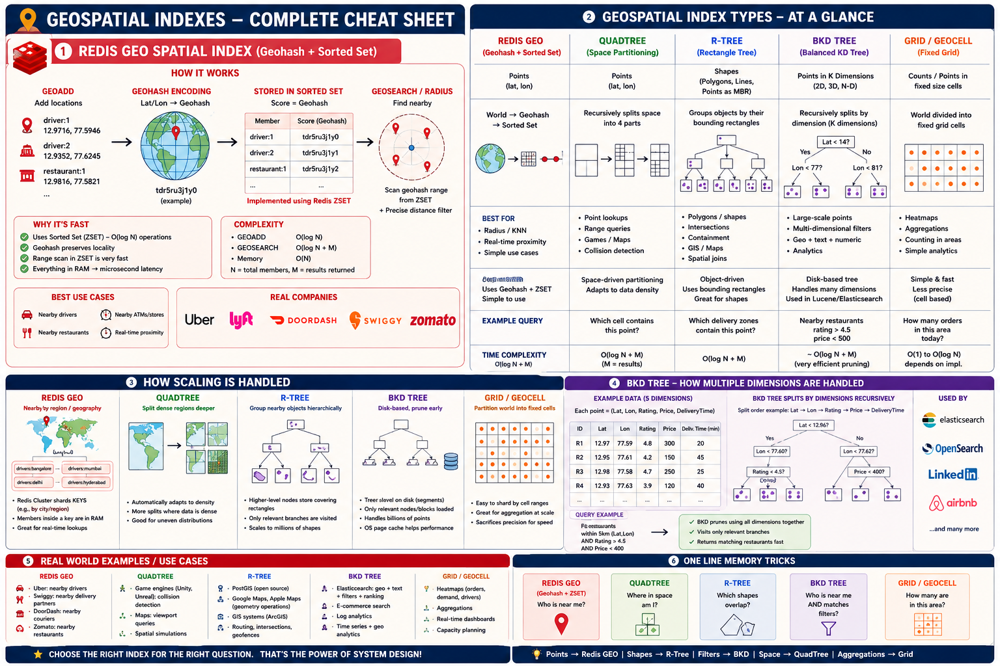

# Redis Geo: Restaurant Discovery Platform

## Introduction

This example demonstrates how to use Redis Geo to build a restaurant discovery platform.

Users can:

- Register restaurant locations
- Retrieve restaurant coordinates
- Calculate distance between restaurants
- Find nearby restaurants within a radius
- Perform location-based searches

Redis Geo provides efficient geospatial indexing and querying capabilities built on top of Redis Sorted Sets.

This makes Redis an excellent choice for:

- Food Delivery Platforms
- Ride Sharing Applications
- Store Locators
- Fleet Tracking
- Location-Based Recommendations

---

## What You'll Learn

- How Redis Geo works
- How GEOADD stores coordinates
- How GEOPOS retrieves coordinates
- How GEODIST calculates distance
- How GEOSEARCH finds nearby locations
- Geohash fundamentals
- Geo indexing internals
- Scaling location-based systems
- Production considerations for geo workloads

---

## Why Use Redis Geo?

Suppose a food delivery application needs to answer:

```text
Which restaurants are within 5 km of this customer?
```

Without Redis Geo:

```text
Read all restaurants
Calculate distance
Filter results
Sort by distance
Return nearest restaurants
```

With Redis Geo:

```text
GEOSEARCH
```

Redis performs the search using a geospatial index.

Benefits:

- Fast radius searches
- Distance calculations
- Built-in geo indexing
- Low latency lookups
- Memory efficient
- Simple API

---

## Why Not Store Coordinates in a Database?

Restaurant table:

```text
restaurant

id
name
latitude
longitude
```

To find nearby restaurants:

```text
Read all rows
Calculate distances
Sort results
Filter by radius
```

This becomes expensive as data grows.

Example:

```text
10 restaurants      -> Fine
10,000 restaurants  -> Expensive
1,000,000 locations -> Very expensive
```

Redis Geo maintains a geospatial index optimized for these queries.

---

## Real-World Use Cases

### Food Delivery

```text
Restaurants near me
```

### Ride Sharing

```text
Nearest available driver
```

### Store Locator

```text
Nearest store
```

### Logistics

```text
Track delivery vehicles
```

### Travel Applications

```text
Hotels near airport
```

---

## Redis Key Design

Restaurant locations:

```text
restaurants:locations
```

Restaurant identifiers:

```text
restaurant-101
restaurant-102
restaurant-103
```

Example:

```text
restaurants:locations

restaurant-101 -> Bangalore
restaurant-102 -> Whitefield
restaurant-103 -> Koramangala
```

---

## Architecture

```text
                     HTTP Requests
                           |
                           v
               +----------------------+
               | RestaurantController |
               +----------------------+
                           |
                           v
               +----------------------+
               | RestaurantRepository |
               +----------------------+
                           |
                           v
               +----------------------+
               | Redis Geo Index      |
               | restaurants:locations|
               +----------------------+
```

Flow:

```text
Restaurant Added
        |
        v
     GEOADD
        |
        v
  Geo Index Updated

Nearby Search
        |
        v
    GEOSEARCH
        |
        v
 Nearby Restaurants
```

---

## Redis Commands

| Command | Description |
|----------|-------------|
| GEOADD | Store coordinates |
| GEOPOS | Retrieve coordinates |
| GEODIST | Calculate distance |
| GEOSEARCH | Radius search |

---

## Example Commands

### Add Restaurant

```redis
GEOADD restaurants:locations \
77.5946 12.9716 restaurant-101
```

### Retrieve Coordinates

```redis
GEOPOS restaurants:locations restaurant-101
```

### Distance Between Restaurants

```redis
GEODIST restaurants:locations \
restaurant-101 \
restaurant-102 KM
```

### Search Nearby Restaurants

```redis
GEOSEARCH restaurants:locations \
FROMLONLAT 77.5946 12.9716 \
BYRADIUS 5 KM
```

---

## How Redis Geo Works Internally

Redis Geo is implemented using:

```text
Sorted Set
+
Geohash
```

Internally:

```text
Latitude + Longitude
        |
        v
      Geohash
        |
        v
 Sorted Set Score
```

Redis converts geographic coordinates into a Geohash value.

That Geohash is stored as the score in a Redis Sorted Set.

This allows Redis to efficiently search nearby locations.

---

## Geohash Deep Dive

A Geohash is a string representation of a geographic area.

Example:

```text
Bangalore

Latitude  : 12.9716
Longitude : 77.5946

Geohash: tdr1v9
```

Nearby locations share similar prefixes:

```text
tdr1v9
tdr1vb
tdr1vc
```

Redis uses this property to quickly identify nearby locations.
## Geohash Prefixes and Sorted Set Lookup

One of the key ideas behind Redis Geo is that nearby locations tend to share common Geohash prefixes.

Example:

```text
Restaurant A -> tdr1v9
Restaurant B -> tdr1vb
Restaurant C -> tdr1vc
```

Notice that all three locations start with:

```text
tdr1v
```

This indicates that they belong to the same geographic region.

As locations become closer together, they tend to share longer prefixes.

Example:

```text
tdr1v9x
tdr1v9y
tdr1v9z
```

These locations are much closer than:

```text
tdr1v9
tdr4ab
tdr8xy
```

---

### Geohash Precision

Longer geohashes represent smaller geographic areas.

| Geohash Length | Approximate Area |
|---------------|------------------|
| 1 | 5,000 km |
| 2 | 1,250 km |
| 3 | 156 km |
| 4 | 39 km |
| 5 | 4.9 km |
| 6 | 1.2 km |
| 7 | 150 m |
| 8 | 38 m |

Example:

```text
tdr1v
```

represents a much larger area than:

```text
tdr1v9x
```

which represents a very small region.

---

### How Redis Uses Geohashes

Internally Redis converts:

```text
Latitude + Longitude
```

into:

```text
Geohash
```

The Geohash is then converted into a sortable 52-bit integer.

Conceptually:

```text
Restaurant
      |
      v
Latitude / Longitude
      |
      v
    Geohash
      |
      v
52-bit Integer
      |
      v
Sorted Set Score
```

Redis stores all locations inside a Sorted Set.

Conceptually:

```text
Key: restaurants:locations

Score              Member
-----------------------------------
3479099956235      restaurant-101
3479099956241      restaurant-102
3479099956250      restaurant-103
```

The actual score values are encoded geohashes.

---

### Why Prefixes Matter

Suppose a user searches near:

```text
Latitude  : 12.9716
Longitude : 77.5946
```

Redis computes a geohash for the search location.

Example:

```text
tdr1v9
```

Redis can immediately narrow the search to nearby geohash ranges.

Instead of scanning:

```text
1,000,000 restaurants
```

Redis only examines locations that belong to neighboring geohash regions.

Conceptually:

```text
Entire Sorted Set
        |
        v
 Nearby Geohash Range
        |
        v
 Candidate Restaurants
        |
        v
 Exact Distance Calculation
        |
        v
 Final Results
```

This dramatically reduces the amount of work required.

---

### Neighbor Expansion

A common question is:

```text
What happens if a restaurant is just across a Geohash boundary?
```

Example:

```text
+-----------+-----------+
|  tdr1v8   |  tdr1v9   |
+-----------+-----------+
```

A nearby restaurant may fall into a neighboring Geohash cell.

Redis handles this by searching adjacent Geohash regions as well.

Conceptually:

```text
Current Cell

      +

Neighbor Cells

      =

Search Region
```

This ensures nearby locations are not missed near cell boundaries.

### Why Sorted Sets?

Sorted Sets provide:

```text

Range Queries

Ordered Scores

O(log N) Access

```

Geohashes naturally produce sortable values.

This makes Sorted Sets an ideal underlying structure for geographic indexing.

Interview answer:

```text

Redis Geo is implemented using a Sorted Set where the score is an encoded Geohash derived from latitude and longitude.

```

This design allows Redis to perform efficient proximity searches without scanning every location.

## Redis Geo vs Sorted Set

Many engineers do not realize:

```text
Redis Geo
=
Sorted Set
+
Geohash
```

Conceptually:

```text
Sorted Set
    score = numeric score

Geo
    score = geohash value
```

Redis simply exposes geo-specific commands on top of Sorted Sets.

---

## Geo Search Flow

```text
User Location
      |
      v
Redis Geo Index
      |
      v
Candidate Restaurants
      |
      v
Distance Sorting
      |
      v
Nearest Restaurants Returned
```

This avoids scanning all restaurants.

---

## Time Complexity

| Command | Complexity |
|----------|------------|
| GEOADD | O(log N) |
| GEOPOS | O(log N) |
| GEODIST | O(log N) |
| GEOSEARCH | O(log N + M) |

Where:

```text
N = Total Locations
M = Results Returned
```

---

## Run Example

Start Redis:

```bash
docker compose up -d
```

Start the application:

```bash
./gradlew bootRun
```

---

## REST API Summary

| Method | Endpoint | Description |
|----------|----------|-------------|
| POST | /api/restaurants | Add restaurant |
| GET | /api/restaurants/{id}/location | Get coordinates |
| GET | /api/restaurants/distance | Calculate distance |
| GET | /api/restaurants/nearby | Find nearby restaurants |

---

## curl Examples

### Add Restaurant

```bash
curl -X POST http://localhost:8080/api/restaurants \
-H "Content-Type: application/json" \
-d '{
  "id":"restaurant-101",
  "name":"Biryani House",
  "latitude":12.9716,
  "longitude":77.5946
}'
```

Response:

```json
{
  "id":"restaurant-101",
  "name":"Biryani House",
  "latitude":12.9716,
  "longitude":77.5946
}
```

---

### Get Restaurant Location

```bash
curl \
http://localhost:8080/api/restaurants/restaurant-101/location
```

---

### Find Nearby Restaurants

```bash
curl \
"http://localhost:8080/api/restaurants/nearby?latitude=12.9716&longitude=77.5946&radiusKm=5"
```

Response:

```json
[
  "restaurant-101",
  "restaurant-102",
  "restaurant-103"
]
```

---

### Calculate Distance

```bash
curl \
"http://localhost:8080/api/restaurants/distance?from=restaurant-101&to=restaurant-102"
```

Response:

```json
{
  "from":"restaurant-101",
  "to":"restaurant-102",
  "distanceKm":2.4
}
```

---

## Inspect Data Directly in Redis

Add Restaurant:

```bash
docker exec redis-local redis-cli \
GEOADD restaurants:locations \
77.5946 12.9716 restaurant-101
```

Retrieve Coordinates:

```bash
docker exec redis-local redis-cli \
GEOPOS restaurants:locations restaurant-101
```

Search Nearby:

```bash
docker exec redis-local redis-cli \
GEOSEARCH restaurants:locations \
FROMLONLAT 77.5946 12.9716 \
BYRADIUS 5 KM
```

---

## Accuracy Considerations

Redis Geo is highly accurate for:

```text
Nearby Search
Store Locator
Food Delivery
Ride Sharing
```

However Redis Geo is not designed for:

```text
Property Boundaries
Polygon Search (give me everything that falls inside this exact custom shape.)
Route Planning
Advanced GIS Analytics
```

Redis Geo uses geohashes and therefore performs approximate geographic indexing.

For most applications the approximation is negligible.

---

## Scaling Strategies

### City-Based Partitioning

Avoid:

```text
restaurants:locations
```

for global-scale deployments.

Prefer:

```text
restaurants:bangalore
restaurants:hyderabad
restaurants:mumbai
restaurants:chennai
```

Benefits:

- Smaller search space
- Better cache locality
- Reduced shard pressure
- Easier scaling

---

### Multi-Tenant Partitioning

For SaaS platforms:

```text
tenant:1:restaurants
tenant:2:restaurants
tenant:3:restaurants
```

instead of a giant shared index.

---

### Driver Tracking vs Static Locations

Restaurants:

```text
Mostly static
```

Drivers:

```text
Continuously moving
```

Example:

```text
Uber
Swiggy
Zomato
DoorDash
```

Drivers may update location every few seconds.

This creates significantly higher write throughput.

---

### Hot Region Problem

Some locations generate far more traffic.

Example:

```text
Bangalore City Center
```

vs

```text
Small Town
```

Popular urban regions may become hotspots.

Mitigation strategies:

- City partitioning
- Region partitioning
- Geohash partitioning
- Search result caching

---

### Caching Popular Searches

Popular searches often repeat.

Examples:

```text
Restaurants near Koramangala
Restaurants near Whitefield
Restaurants near MG Road
```

Caching these results can dramatically reduce query load.

---

## Production Considerations

### Radius Selection

Poor choice:

```text
100 KM radius
```

Good choices:

```text
Food Delivery -> 5 KM
Ride Sharing  -> 10 KM
Store Locator -> 25 KM
```

Larger radii increase result size and latency.

---

### Data Retention

Static locations:

```text
Restaurants
Stores
Warehouses
```

can live indefinitely.

Dynamic locations:

```text
Drivers
Vehicles
Delivery Partners
```

should expire automatically.

Example:

```text
driver-location:123
TTL = 5 minutes
```

---

### Location Update Frequency

Avoid updating location excessively.

Example:

```text
Every 100 milliseconds
```

Instead:

```text
Every 5-10 seconds
```

or when movement exceeds a threshold.

---

### Redis Geo vs GIS Systems

Redis Geo excels at:

```text
Nearby Search
Distance Calculations
Location Indexing
```

Redis Geo is not a replacement for:

```text
PostGIS
ArcGIS
Advanced GIS Platforms
```

---

### Redis Geo + PostGIS Pattern

A common architecture:

```text
Redis Geo
        |
        v
 Fast Nearby Search

PostGIS
        |
        v
 Advanced GIS Queries
```

Redis handles low-latency lookups.

PostGIS remains the system of record.

---

## Complete Example

Restaurants:

```text
restaurant-101
restaurant-102
restaurant-103
restaurant-104
```

Customer Location:

```text
Latitude  : 12.9716
Longitude : 77.5946
```

Search:

```redis
GEOSEARCH restaurants:locations \
FROMLONLAT 77.5946 12.9716 \
BYRADIUS 5 KM
```

Result:

```text
restaurant-101
restaurant-102
```

Only restaurants within 5 KM are returned.

---

## Key Takeaways

- Redis Geo is built on top of Sorted Sets.
- Redis Geo uses Geohash internally.
- GEOADD stores coordinates.
- GEOPOS retrieves coordinates.
- GEODIST calculates distance.
- GEOSEARCH performs radius searches.
- Geo indexes scale efficiently.
- Partitioning is critical at large scale.
- Redis Geo is ideal for nearby search workloads.

---

## Interview Notes

### How is Redis Geo implemented internally?

Redis Geo is implemented using:

```text
Sorted Set
+
Geohash
```

Coordinates are encoded into geohashes and stored as Sorted Set scores.

---

### Why is Redis Geo fast?

Redis uses geospatial indexing rather than scanning every location.

Nearby searches operate on indexed geohash ranges.

---

### What commands are commonly used?

```redis
GEOADD
GEOPOS
GEODIST
GEOSEARCH
```

---

### When should you use Redis Geo?

- Food Delivery
- Ride Sharing
- Store Locator
- Fleet Tracking
- Nearby Search

---

### When is Redis Geo not sufficient?

When you need:

- Route Planning
- Polygon Queries
- Geofencing
- Advanced GIS Analytics

Use PostGIS or another GIS platform.

---

### How would you scale Redis Geo?

- Partition by city
- Partition by region
- Partition by tenant
- Cache popular searches
- Separate static and dynamic locations

---

### What is the Hot Region Problem?

A small geographic area may generate disproportionate traffic.

Examples:

```text
City Centers
Airports
Shopping Districts
```

Partitioning and caching help distribute load.

## Advanced Geospatial Index Comparison



Each approach below makes different trade-offs between simplicity, latency, and the
types of queries it can answer. Pick the one whose strengths match your workload.

> **Two levels of abstraction, not one menu.** The entries below fall into two
> different categories that are easy to confuse:
>
> - **Index structures** (QuadTree, R-Tree, BKD Tree, Grid/Geocell) are *algorithms* —
>   building blocks. You don't deploy them directly.
> - **Systems** (Redis Geo, PostGIS, Elasticsearch Geo) are *products* you actually run,
>   and each one is **built on** one of those structures.
>
> So you never choose "R-Tree *vs* PostGIS" — choosing PostGIS *means* using an R-Tree.
> The mapping is:
>
> | System | Built on | Best at |
> |---|---|---|
> | Redis Geo | Geohash + Sorted Set | sub-ms "what's nearby?" |
> | PostGIS | R-Tree (via GiST) | polygons, routing, spatial joins |
> | Elasticsearch Geo | BKD Tree | geo + text + attribute filters |
>
> The sections below are grouped accordingly: **Index Structures** first, then the
> **Systems** that use them.

---

### Quick Decision Guide

| I need to... | Use this |
|---|---|
| Find nearby drivers, restaurants, or stores | Redis Geo |
| Check if a coordinate is inside a delivery zone or polygon | R-Tree / PostGIS |
| Search "nearby AND rating > 4 AND price < $20" | BKD Tree / Elasticsearch Geo |
| Build a game map or detect object collisions | QuadTree |
| Generate heatmaps or count events per region | Grid / Geocell |
| Run routing, boundary joins, or complex spatial analytics | PostGIS |
| Combine "near me" with full-text search and filters | Elasticsearch Geo |

---

### Comparison Matrix

| Technology | Kind | Stores | Best query | Latency | Complexity |
|---|---|---|---|---|---|
| Redis Geo | System | Points | Radius search | < 1 ms | Low |
| QuadTree | Structure | Points | Region / collision | 1–5 ms | Medium |
| R-Tree | Structure | Shapes + Points | Polygon containment | 5–20 ms | Medium |
| BKD Tree | Structure | Points + attributes | Multi-dimensional range | 1–10 ms | Medium |
| Grid / Geocell | Structure | Points | Aggregation / heatmap | < 1 ms | Very low |
| PostGIS | System | Shapes + Points | Any spatial query | 5–50 ms | High |
| Elasticsearch Geo | System | Points | Geo + text + filters | 5–20 ms | High |

*Latency/complexity for the bare structures reflects a typical implementation; in
practice you get them via the System that embeds them.*

---

### Index Structures (The Building Blocks)

These are *algorithms*, not products. You don't deploy a QuadTree or an R-Tree on its
own — you use one of the **Systems** further below that has it built in. Redis Geo's own
structure (Geohash + Sorted Set) is covered in the earlier "Geohash Deep Dive" section.

#### QuadTree

**What it is:** A tree that recursively splits space into four quadrants. Dense areas get finer splits automatically; sparse areas stay coarse.

```text
Sparse area          Dense city area
+----------+         +----+----+
|          |    →    | ++ | ++ |
|          |         +----+----+
+----------+         | ++ |    |
                     +----+----+
```

**Pros**
- Adapts to uneven data density — no wasted cells in empty areas
- Efficient region and collision queries
- Natural fit for hierarchical map zoom levels

**Cons**
- More complex to implement and rebalance than a flat index
- Radius queries near cell boundaries must check multiple cells
- Not suitable for polygon queries or attribute filtering

**Use when** objects move continuously in a bounded space (games, simulations) or you need efficient map tile rendering.

**Skip when** a simple radius lookup is all you need — Redis Geo is simpler and faster.

**Used by:** Google Maps and Apple Maps (tile rendering), Unreal Engine and Unity (collision detection), Riot Games (in-game spatial queries)

---

#### R-Tree

**What it is:** A hierarchy of bounding rectangles wrapping shapes. A containment query walks the tree and skips any branch whose bounding box doesn't overlap the query area.

```text
Root bbox
├── City North bbox
│   ├── Zone A polygon
│   └── Zone B polygon
└── City South bbox
    ├── Zone C polygon
    └── Zone D polygon
```

**Pros**
- Natively stores and queries polygons, lines, and shapes — not just points
- Efficient "is this point inside this zone?" containment checks
- Industry standard: PostGIS, SpatiaLite, and most GIS databases use R-Tree internally

**Cons**
- Higher write cost than Redis Geo (bounding boxes must be updated up the tree)
- Overkill for simple point-radius queries
- Not available natively in Redis — needs PostGIS or a GIS database

**Use when** you need geofencing (is a user inside a delivery zone?), polygon search, or spatial joins.

**Skip when** all your data is points and you only need radius search.

**Used by:** Uber (surge zone and airport geofencing via PostGIS), OpenStreetMap (road and boundary data), Mapbox (routing pipelines), Foursquare (venue boundaries)

---

#### BKD Tree

**What it is:** A multi-dimensional tree that indexes latitude, longitude, and other attributes (rating, price, delivery time) together. A single query prunes branches where any dimension falls outside the required range.

```text
Each point is indexed on 3 dimensions: (lat, lon, rating)
The split dimension cycles by depth →  depth 0: LAT   depth 1: LON   depth 2: RATING

                        [ LAT < 12.95 ]                       depth 0 · LAT
              ┌───────────────┴───────────────┐
       [ LON < 77.62 ]                  [ LON < 77.63 ]       depth 1 · LON
        ┌──────┴──────┐                  ┌──────┴──────┐
   [RAT < 3.9]   [RAT < 4.8]       [RAT < 4.35]   [RAT < 3.8] depth 2 · RATING
    ┌───┴──┐      ┌───┴──┐          ┌────┴──┐      ┌───┴──┐
    R2    R4      R3    R7          R5     R1      R6    R8    leaves = full point

  R1 12.97,77.59 ★4.5   R2 12.94,77.61 ★3.8   R3 12.91,77.64 ★4.7   R4 12.93,77.58 ★4.0
  R5 12.99,77.60 ★4.2   R6 12.96,77.66 ★3.5   R7 12.92,77.62 ★4.9   R8 12.95,77.63 ★4.1

  left branch = value < split      right branch = value ≥ split

A query like  lat ∈ [12.93,12.97] ∧ lon ∈ [77.57,77.62] ∧ rating ≥ 4.0  → matches R4, R1,
pruning all other branches in a single pass. RATING only gets its own split once the
LAT/LON splits have narrowed a cell that still holds more than one point (in real BKD,
more points than fit in one leaf block). Lucene actually splits on whichever dimension
has the widest spread at each node, so rating can be chosen earlier than depth 2.
```

**Pros**
- Combines proximity with arbitrary attribute filters in one index pass
- No need to fetch thousands of nearby results and filter them in application code
- Production-proven inside Elasticsearch and Lucene at massive scale

**Cons**
- Not available standalone — requires Elasticsearch, OpenSearch, or Lucene
- Higher infrastructure cost and operational complexity than Redis
- Overkill when distance is the only filter

**Use when** your search combines location with other filters: "nearby restaurants, rating > 4, open now, price < $20".

**Skip when** distance is the only filter (Redis Geo is simpler), or you need polygon queries (PostGIS is better).

**Used by:** Airbnb (property search), Yelp (business discovery), LinkedIn (job search), DoorDash (restaurant search with filters)

---

#### Grid / Geocell Index

**What it is:** The world divided into a fixed grid of equal-size cells. Every coordinate is assigned to a cell by rounding. Aggregations become a simple group-by on the cell ID.

```text
          | lon -78 | lon -77 | lon -76 |
----------+---------+---------+---------+
lat 13    |   A1    |   B1    |   C1    |
lat 12    |   A2    | [ B2 ]  |   C2    |  ← restaurant in cell B2
lat 11    |   A3    |   B3    |   C3    |
```

**Pros**
- Extremely simple — cell assignment is just arithmetic
- Very fast for aggregations (count, sum, average per region)
- Easy to shard: each cell is an independent key

**Cons**
- Fixed cell size: points near a boundary may land in the wrong cell
- Poor fit for "nearest N" lookups — Redis Geo is more precise
- Cell size must be chosen upfront and is hard to change later

**Use when** you need heatmaps, regional event counts, or demand forecasting grids.

**Skip when** you need precise nearest-neighbour search or polygon queries.

**Used by:** Uber and Lyft (H3 hexagonal grid for surge pricing and demand forecasting), Pokémon GO (S2 cells for spawn and gym placement), Google (S2 cells in Maps and Street View)

---

### Systems (What You Actually Deploy)

These are real products you run in production. Each is powered by one of the structures
above, wrapped with storage, a query language, and durability:

| System | Built on | Best at |
|---|---|---|
| Redis Geo | Geohash + Sorted Set | sub-ms "what's nearby?" |
| PostGIS | R-Tree (via GiST) | polygons, routing, spatial joins |
| Elasticsearch Geo | BKD Tree | geo + text + attribute filters |

#### Redis Geo

**What it is:** Coordinates encoded as scores in a Redis Sorted Set. Nearby locations get similar scores, so a radius search is just a range scan — no full scan needed.

**Pros**
- Sub-millisecond latency, data lives in memory
- Four commands cover almost every use case (GEOADD, GEOPOS, GEODIST, GEOSEARCH)
- No extra infrastructure if Redis is already in the stack

**Cons**
- Points only — no polygons or shapes
- Cannot combine distance with other filters (rating, price, etc.) natively
- One key = one shard; a global index becomes a hot key at scale

**Use when** you need fast nearest-neighbour lookups for points: drivers, restaurants, stores, users.

**Skip when** you need polygon containment, attribute filtering, or routing.

**Used by:** Swiggy, Zomato, Grab, Gojek (driver/restaurant discovery), Snapchat (Snap Map)

---

#### PostGIS

**What it is:** A full GIS extension for PostgreSQL. Stores points, lines, and polygons with full SQL support. If Redis Geo is a city directory, PostGIS is the city planning department.

**Pros**
- Handles every spatial query type: containment, intersection, routing, spatial joins
- Full SQL — combine spatial queries with all other relational data in one statement
- Industry standard with decades of production use

**Cons**
- Disk-backed: latency is 5–50 ms, not sub-millisecond
- Heavier to operate than Redis — needs PostgreSQL plus the PostGIS extension
- Spatial performance requires careful index tuning and regular VACUUM

**Use when** you need delivery zone containment, routing, boundary joins, land parcel data, or spatial data that participates in relational transactions.

**Skip when** all you need is "find the 10 nearest points" — Redis Geo is far simpler and faster.

**Used by:** OpenStreetMap (planet-scale road and boundary data), Mapbox (routing and isochrones), CARTO (spatial analytics platform), government agencies worldwide (land registries, city planning)

---

#### Elasticsearch Geo

**What it is:** A search engine that understands location. Geo proximity is just another filter alongside text search, ratings, and facets — all handled in one query.

**Pros**
- Combines "near me" with full-text search and attribute filters in a single query
- Rich aggregations: "top cuisines within 5 km", "busiest areas by hour"
- Horizontally scalable — shards across nodes automatically

**Cons**
- Largest infrastructure footprint here — requires an Elasticsearch cluster
- Near-real-time indexing: writes aren't visible immediately
- Overkill when text search and faceting aren't needed

**Use when** your search mixes location with text and filters: "biryani near me, open now, rating > 4".

**Skip when** distance is the only criterion (Redis Geo suffices) or you need polygon queries (PostGIS is better).

**Used by:** Airbnb (property search), LinkedIn (job and people search), Yelp (business discovery), Zalando (location-aware e-commerce search)

---

### How These Layer Together in Production

Most real systems combine two or three of these rather than picking just one:

```text
"Biryani near me, open now, rating > 4"
            |
            v
  Elasticsearch Geo          ← handles text + filters + geo in one query
            |
            v
    Redis Geo (optional)     ← sub-ms distance sort for real-time driver positions
            |
            v
   PostGIS (optional)        ← verify delivery zone containment for final selection
```

---

### Interview Notes

**Redis Geo vs PostGIS?**
Redis Geo answers one question fast: "what is nearby?" PostGIS answers any spatial question correctly. Use Redis Geo for low-latency point lookups; use PostGIS when you need polygons, routing, or spatial joins.

**Why can't Redis Geo handle polygon queries?**
It stores only point coordinates as geohashes. It has no concept of edges or shape boundaries. Polygon containment requires an R-Tree-backed system like PostGIS.

**When to add Elasticsearch alongside Redis Geo?**
When the query combines proximity with text or attribute filters. Redis Geo cannot filter on rating or cuisine; Elasticsearch handles all dimensions in one pass.

**Core trade-off across all approaches?**
Simplicity and latency vs expressive power. Redis Geo is fastest and simplest but answers only "what is nearby?" Each step up the stack — BKD Tree, R-Tree, PostGIS — adds power at the cost of latency, complexity, and infrastructure.