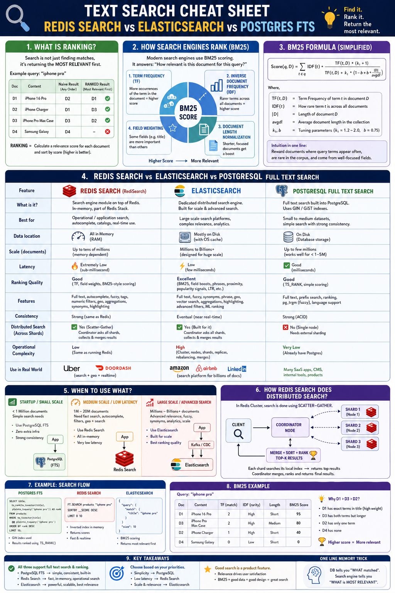

# Redis Search: Full-Text Product Search with BM25 Ranking

## Introduction

This module implements a production-style **full-text product search** with Spring Boot
and the Redis query engine (RediSearch). Products are stored as Redis hashes; a secondary
**index** over those hashes lets you search by free text across weighted fields and get
results ordered by **relevance** — not just "does it match" but "how well does it match".

Unlike a `SCAN` + substring filter, Redis Search builds an **inverted index** and scores
matches with **BM25** (*Best Matching 25*, the Okapi BM25 ranking function), the same
family of ranking used by Elasticsearch and Lucene. A
search for `iphone pro` returns the most relevant product first, with fuzzy matching,
field weighting (a hit in the name counts more than in the description), tag filters, and
numeric range filters.

> **Requires the Redis query engine.** `FT.*` commands are not in plain Redis. This
> cookbook runs `redis:8`, where Search is built into core. On Redis 7 use
> `redis/redis-stack`. The other modules use Spring Data Redis (Lettuce); this one uses
> **Jedis**, whose `FT.*` API maps directly onto the commands below.

> **Redis Search vs Elasticsearch vs Postgres FTS?** See the
> [comparison](#redis-search-vs-elasticsearch-vs-postgres-fts) below for when each one
> wins. One-line version: **good search is ranked, not just matched.**

## Why Redis Search?

A plain Redis lookup is exact-key only. To answer "find products matching these words,
best first" you need an index that knows which documents contain which terms and how
important each term is. Redis Search provides exactly that:

- **Inverted index** — term → list of documents, so matching is fast and does not scan
  every key.
- **Relevance ranking (BM25)** — results are scored and sorted by how well they match.
- **Rich query language** — field-scoped terms (`@name:iphone`), fuzzy (`%iphone%`),
  prefix (`iphon*`), tag filters (`@brand:{apple}`), numeric ranges (`@price:[100 500]`).
- **Secondary indexing of hashes** — index existing hash documents in place; writes to the
  hash are reflected in the index automatically.

It shines when you need operational, low-latency, in-memory search built into the same
Redis you already run — catalogs, autocomplete, type-ahead, faceted filtering.

## Why Not SQL `LIKE` or `SCAN` + Filter?

| Need | `LIKE '%term%'` / `SCAN` + filter | Redis Search |
|------|-----------------------------------|--------------|
| Avoids full scan | No — scans every row/key | **Yes** — inverted index lookup |
| Relevance ranking | No — boolean match only | **Yes** — BM25 scoring |
| Multi-field weighting | Hard / manual | **Yes** — per-field `WEIGHT` |
| Fuzzy / prefix / phrase | Limited | **Yes** — built in |
| Numeric / tag filters with text | Awkward | **Yes** — combined in one query |
| Stays in Redis | n/a | **Yes** — no separate search system |

`LIKE '%term%'` cannot use a B-tree index and degrades linearly; neither approach ranks
results. When you need *relevance*, you need a real search index.

## Index & Schema Design

The index is created once with `FT.CREATE`, declaring which hash fields are searchable and
how. Documents are ordinary hashes under a key prefix; indexing happens automatically.

```text
Key prefix:  product:{id}              # each product is a hash
Index name:  products-idx              # the secondary index over those hashes

Schema:
  name        TEXT     WEIGHT 5.0      # most important — a name hit ranks highest
  description TEXT     WEIGHT 1.0      # least important
  brand       TAG                      # exact-match facet: @brand:{apple}
  category    TAG                      # exact-match facet: @category:{phone}
  price       NUMERIC  SORTABLE        # range filter + sortable: @price:[100 500]
```

Field types matter:

- **TEXT** fields are tokenized and full-text searchable, with a per-field `WEIGHT` that
  scales their BM25 contribution.
- **TAG** fields are not tokenized; they match exact values and power facets/filters.
- **NUMERIC** fields support range filters; `SORTABLE` allows ordering and faster sorts.

## Architecture

```text
                         HTTP requests
                              |
                              v
                 +--------------------------+
                 |   ProductSearchController  |
                 +--------------------------+
                              |
                              v
                 +--------------------------+
                 |   ProductSearchRepository  |
                 |   (Jedis FT.* commands)    |
                 +--------------------------+
                       |                       \
        index (HSET)   |                        \  FT.SEARCH "iphone pro" SCORER BM25
                       v                         v
        +---------------------------+   +---------------------------+
        | Hash: product:{id}        |   | Index: products-idx       |
        | name, description, brand, |-->| inverted index + BM25     |
        | category, price           |   | (auto-updated on writes)  |
        +---------------------------+   +---------------------------+
```

On startup the repository ensures `products-idx` exists. Indexing a product is a plain
`HSET` to `product:{id}`; because the key matches the index prefix, the query engine
updates the inverted index automatically. Searching issues `FT.SEARCH` with the BM25
scorer and returns documents ordered by relevance.

## How Ranking Works (BM25)

Search is not just matching — it returns the **most relevant** result first. BM25 scores a
document for a query from a few intuitive signals:

- **Term Frequency (TF)** — more occurrences of the term in a document → higher score
  (with diminishing returns, so 10 hits is not 10× one hit).
- **Inverse Document Frequency (IDF)** — rarer terms across the whole corpus carry more
  weight; common words contribute little.
- **Field weighting** — a hit in a high-`WEIGHT` field (name) counts more than in a
  low-`WEIGHT` field (description).
- **Length normalization** — a match in a short, focused field counts more than the same
  match buried in a long one.

Simplified, for query `q` and document `D`:

```text
score(q, D) = Σ  IDF(t) ·            TF(t, D) · (k1 + 1)
             t∈q          ─────────────────────────────────────
                          TF(t, D) + k1 · (1 − b + b · |D| / avgdl)
```

where `|D|` is the document length, `avgdl` the average across the corpus, and `k1`/`b`
are tuning constants (typically `k1 ≈ 1.2–2.0`, `b = 0.75`). The takeaway: **reward
documents where rare query terms appear often, in short, well-focused fields.**

This module requests BM25 explicitly with `SCORER BM25`; you can return the per-document
score with `WITHSCORES` to see the ranking.

> **Scores are relative to the whole corpus.** IDF and `avgdl` are computed over every
> document in the index, not just the matches for one query. So the same document can score
> differently — and two documents can even swap order — as the index grows or shrinks.
> BM25 scores are therefore meaningful for *ranking within a single query*, not as stable
> absolute numbers; never assert exact scores or cross-query ordering against a shared,
> evolving index.

## RediSearch Commands

| Command | Purpose in this module |
|---------|------------------------|
| `FT.CREATE` | Create the `products-idx` index over `product:` hashes |
| `FT.SEARCH` | Full-text search with ranking, filters, paging |
| `FT.AGGREGATE` | Group/aggregate results (facets, counts) |
| `FT.INFO` | Inspect index definition and stats |
| `FT.EXPLAIN` | Show how a query is parsed |
| `FT.DROPINDEX` | Drop the index (optionally with `DD` to delete docs) |
| `HSET` / `HGETALL` / `DEL` | Write, read, and delete the product hashes |

### Query Syntax Examples

```redis
# Create the index
FT.CREATE products-idx ON HASH PREFIX 1 product: SCHEMA
  name TEXT WEIGHT 5.0 description TEXT WEIGHT 1.0
  brand TAG category TAG price NUMERIC SORTABLE

# Index a product (auto-indexed because the key matches the prefix)
HSET product:1 name "iPhone 16 Pro" description "flagship phone"
  brand apple category phone price 999

# Full-text search, best match first, with scores
FT.SEARCH products-idx "iphone pro" SCORER BM25 WITHSCORES LIMIT 0 10

# Field-scoped, fuzzy, prefix
FT.SEARCH products-idx "@name:iphone"
FT.SEARCH products-idx "%iphone%"        # fuzzy (Levenshtein distance 1)
FT.SEARCH products-idx "iphon*"          # prefix

# Combine text with tag and numeric filters
FT.SEARCH products-idx "phone @brand:{apple} @price:[500 1500]"
```

### Matching: AND vs OR

By default RediSearch combines space-separated terms with **AND** — `iphone pro` matches
only documents containing *both* words, so a relevant "iPhone Charger" (no "pro") is
dropped. For a catalog-style experience this module instead applies **OR** to the
free-text terms and lets BM25 rank the fuller matches higher: it rewrites `iphone pro`
into `(iphone|pro)`. The OR group is parenthesised so any tag/price filters still apply as
AND, e.g. `(iphone|pro) @brand:{apple} @price:[500 2000]`. The result is higher recall
(nothing relevant is silently dropped) with the best match still first.

## Time Complexity

| Operation | Complexity |
|-----------|------------|
| `HSET` (index a doc) | `O(1)` write + index update proportional to indexed terms |
| `FT.SEARCH` | ~`O(log N + k)` to find and rank, where `k` is results returned |
| `FT.CREATE` | `O(1)` to define; existing matching docs are indexed in the background |
| `FT.DROPINDEX` | `O(1)` (without `DD`); `O(N)` with `DD` to delete documents |

Search cost is driven by the number of matching documents and how many you return, not by
the total key count — that is the whole point of the inverted index.

## Common Use Cases

- Product / catalog search with relevance ranking
- Autocomplete and type-ahead (prefix queries, suggestion dictionaries)
- Faceted filtering (tags) combined with free-text and price ranges
- Searching logs, tickets, or documents stored in Redis
- Secondary indexing of existing hash/JSON data for ad-hoc queries

## How Redis Search Works Internally

The query engine maintains an **inverted index**: for every term it stores the list of
documents (and positions) containing that term. A query intersects/union these lists
instead of scanning keys, then scores the surviving documents with the configured scorer
(BM25). TEXT fields are tokenized (split, lower-cased, optionally stemmed and
stop-worded); TAG fields are stored verbatim for exact matching; NUMERIC fields are kept
in a structure that supports range lookups.

Indexing is **synchronous with writes by key prefix**: when you `HSET` a hash whose key
matches the index prefix, the engine updates the inverted index as part of that write, so
searches see the change immediately. There is no separate ingestion pipeline to manage.

## Cluster Considerations

In Redis Cluster the index is distributed across shards. A search uses **scatter–gather**:
a coordinator node forwards the query to every shard, each shard searches its **local**
portion of the index and returns its top results, and the coordinator **merges, re-ranks,
and returns** the global top-K.

```text
client ─► coordinator ─┬─► shard 1 (local top-K)
                       ├─► shard 2 (local top-K)
                       └─► shard 3 (local top-K)
                              │
                       merge + re-rank ─► global top-K
```

This scales horizontally, but global ranking requires the merge step, and very deep paging
(`LIMIT 100000 10`) is expensive because each shard must contribute enough candidates.

## Scaling Strategies

- **Shard for size and throughput.** Distribute the index across cluster shards; searches
  scatter-gather automatically.
- **Page shallowly.** Prefer `LIMIT 0 N` with reasonable `N`; avoid deep offsets. Use
  cursors/`FT.AGGREGATE` for large result processing.
- **Index only what you query.** Every indexed field costs memory and write time; keep the
  schema lean and use `NOINDEX`/`SORTABLE` deliberately.
- **Tune relevance.** Adjust field `WEIGHT`s and BM25 `k1`/`b`; test against real queries.
- **Right-size text processing.** Stemming, stop-words, and phonetic matching change both
  recall and index size — choose per field.

## Run Example

Start Redis 8 (with the query engine) and the application:

```bash
docker compose up -d
./gradlew bootRun
```

The application expects Redis on `localhost:6379` unless overridden. On startup the
repository creates `products-idx` if it does not already exist.

## curl Examples

Index a few products:

```bash
curl -i -X POST http://localhost:8080/api/products \
  -H 'Content-Type: application/json' \
  -d '{"id":"1","name":"iPhone 16 Pro","description":"flagship phone","brand":"apple","category":"phone","price":999.00}'

curl -i -X POST http://localhost:8080/api/products \
  -H 'Content-Type: application/json' \
  -d '{"id":"2","name":"iPhone Charger","description":"usb-c charger for iphone","brand":"apple","category":"accessory","price":29.00}'
```

Search by relevance (best match first):

```bash
curl 'http://localhost:8080/api/products/search?q=iphone%20pro'
```

Response (scored, newest-relevance first):

```json
{
  "query": "iphone pro",
  "total": 2,
  "results": [
    { "id": "1", "name": "iPhone 16 Pro", "brand": "apple", "category": "phone", "price": 999.00, "score": 1.85 },
    { "id": "2", "name": "iPhone Charger", "brand": "apple", "category": "accessory", "price": 29.00, "score": 0.42 }
  ]
}
```

Filter text with a tag and a price range:

```bash
curl 'http://localhost:8080/api/products/search?q=phone&brand=apple&minPrice=500&maxPrice=1500'
```

Drive it directly in Redis:

```bash
docker exec redis-local redis-cli FT.SEARCH products-idx "iphone pro" SCORER BM25 WITHSCORES LIMIT 0 10
docker exec redis-local redis-cli FT.INFO products-idx
```

## Redis Search vs Elasticsearch vs Postgres FTS



All three support full-text search and ranking; they differ in scale, operational cost,
and where the data lives.

| Aspect | Redis Search | Elasticsearch | Postgres FTS |
|--------|--------------|---------------|--------------|
| What it is | Search engine on top of Redis (in-memory) | Dedicated distributed search engine | Full-text search inside PostgreSQL |
| Data location | In RAM | On disk (with OS cache) | On disk (the database) |
| Best for | Operational / app search, autocomplete, catalogs, real-time | Large search platforms, complex relevance, analytics | Small–medium datasets, simple search with strong consistency |
| Scale | Up to tens of millions (memory-bound) | Millions → billions | Up to a few million (works well < 1–5M) |
| Latency | Extremely low (sub-millisecond) | Low (few ms) | Good (ms) |
| Ranking quality | Good (TF, field weights, BM25) | Excellent (field boosts, phrases, popularity, ML) | Good (`ts_rank`, simple) |
| Consistency | Strong (same as Redis) | Eventual (near real-time) | Strong (ACID) |
| Operational cost | Low (it's just Redis) | High (cluster, shards, rebalancing) | Very low (already have Postgres) |

Rules of thumb from the cheat sheet:

- **Startup / small scale, strong consistency** → Postgres FTS.
- **Medium scale, low latency, real-time, autocomplete** → Redis Search.
- **Large scale, advanced relevance/analytics, billions of docs** → Elasticsearch.

## Production Considerations

- **Provision the query engine.** Use Redis 8 or Redis Stack; the index lives in memory, so
  size RAM for both data and index.
- **Make indexing idempotent.** Re-indexing a product is just an `HSET` of the same key;
  deletes must remove the hash so it leaves the index.
- **Guard the query language.** User input becomes a query — escape or restrict special
  characters to avoid syntax errors and overly expensive queries.
- **Bound result sets.** Always `LIMIT`; reject deep paging. Use `FT.AGGREGATE` cursors for
  bulk reads.
- **Tune relevance deliberately.** Field weights and BM25 parameters are product decisions;
  measure against real queries, not anecdotes.
- **Persist and recover.** Indexes are rebuilt from the underlying data on load; ensure RDB/
  AOF and replication cover the hashes so the index can be reconstructed after a restart.
- **Observe.** Monitor `FT.INFO` (index size, indexing failures), query latency, and memory.

## Interview Notes

**How is Redis Search different from a `SCAN` + filter?**

`SCAN` walks every key and a substring filter only answers yes/no. Redis Search keeps an
inverted index (term → documents) so it finds matches without scanning, and it ranks them
by relevance with BM25 instead of returning an unordered set.

**What is BM25 and what drives the score?**

A ranking function based on term frequency (more hits → higher, with diminishing returns),
inverse document frequency (rarer terms matter more), document/field length normalization,
and per-field weights. It rewards documents where rare query terms appear often in short,
focused, high-weight fields.

**How are hash documents kept in sync with the index?**

`FT.CREATE ... ON HASH PREFIX` ties the index to a key prefix. Any `HSET`/`DEL` on a key
with that prefix updates the index as part of the write, so searches see changes
immediately — no separate ingestion step.

**What field types does the schema use and why?**

TEXT (tokenized, full-text, weighted) for searchable prose; TAG (verbatim, exact match)
for facets/filters like brand; NUMERIC (range-queryable, optionally SORTABLE) for prices.

**How does search work in Redis Cluster?**

Scatter–gather: a coordinator queries every shard, each searches its local index slice and
returns local top results, and the coordinator merges and re-ranks into the global top-K.

**When would you choose Elasticsearch or Postgres FTS over Redis Search?**

Postgres FTS for small/medium datasets where the data already lives in Postgres and strong
consistency matters; Elasticsearch for very large corpora and advanced relevance/analytics.
Redis Search for low-latency operational search that should stay within Redis.
